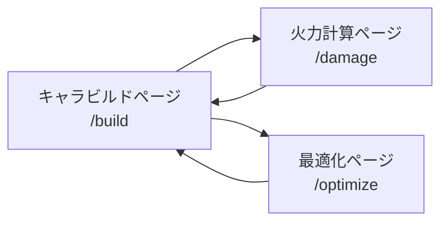
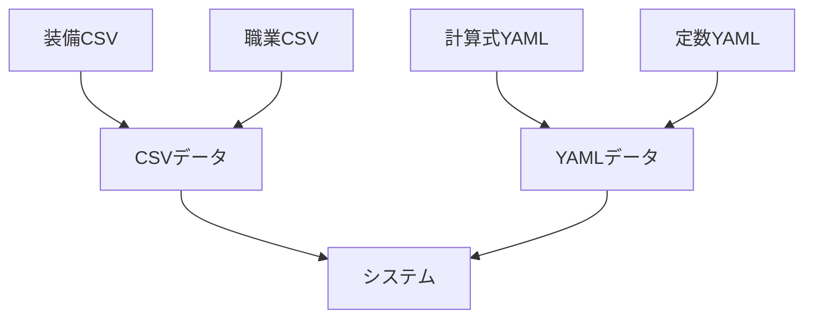

# 01_システム概要

**バージョン**: 1.0
**最終更新日**: 2025-11-22

## 1. プロダクトの目的

### 1.1 解決する課題
Minecraft RPGサーバーにおいて、プレイヤーが以下の課題に直面している:
- キャラクタービルドの最終ステータスを正確に把握できない
- スキル・装備の組み合わせによるダメージ計算が複雑で手計算が困難
- 最適な装備構成を見つけるために膨大な試行錯誤が必要

### 1.2 ターゲットユーザー
- Minecraft RPGサーバーのプレイヤー
- キャラクタービルドの最適化を行いたいユーザー
- ダメージ計算を正確に把握したいユーザー

### 1.3 この仕様書の読者
- フロントエンド開発者
- バックエンド開発者
- QAエンジニア
- プロジェクトマネージャー

## 2. システム構成

### 2.1 ページ構成

本ツールは以下の3つの主要ページで構成される:

#### 2.1.1 キャラビルドページ (/build)
- **目的**: 職業・SP・装備・バフの設定から最終ステータスをリアルタイム算出
- **主要機能**:
  - 職業・レベル選択
  - SP割り振り
  - 装備選択・設定（武器、防具、アクセサリー、紋章、ルーンストーン、リング）
  - バフ設定（食べ物バフ）
  - 高度設定（手動ステータス調整、武器固有能力）
  - 最終ステータス表示（内訳付き）

#### 2.1.2 火力計算ページ (/damage)
- **目的**: ビルドを前提に敵パラメータとスキル選択から火力を算出
- **主要機能**:
  - ビルド読み込み
  - 敵パラメータ入力
  - スキル/通常攻撃選択
  - ダメージ計算結果表示
  - MP効率・秒間火力表示

#### 2.1.3 最適化ページ (/optimize)
- **目的**: 職業・スキル固定で装備構成を探索し、最大ダメージのビルドを列挙
- **主要機能**:
  - 探索条件入力
  - 装備組み合わせ探索実行
  - 結果一覧表示（ソート・フィルタリング）
  - CSV出力
  - ビルド詳細表示
  - ビルドのキャラビルドページへの読み込み

### 2.2 共通UIコンポーネント

| 要素 | 入力形式 | 用途 |
|:---|:---|:---|
| 数値入力 | number型 + ステッパー | レベル、強化値、叩き回数など |
| スライダー | range型 | SP割り振り、探索条件の閾値 |
| トグル | checkbox/switch | リング、食べ物バフ、錬金のON/OFF |
| ドロップダウン | select | 装備・スキル・職業選択 |
| ラジオボタン | radio | ランク選択（SSS〜F） |

### 2.3 非表示・無効化ルール（全ページ共通）

#### 2.3.1 装備
- 職業が装備できない武器種/防具種は候補リストに表示しない
- 使用可能レベルを満たさない装備はグレーアウト（選択不可）

#### 2.3.2 スキル
- 現在の職業で取得できないスキルは候補リストに表示しない
- SP不足で取得条件を満たさないスキルはグレーアウト
- 武器種が非対応のスキルは選択不可

#### 2.3.3 武器固有能力
- 対応武器以外のときは自動OFF + グレーアウト

### 2.4 計算トリガー

#### 2.4.1 ステータス計算（UserStatusFormula）
- **トリガー**: 職業・レベル・SP・装備・ルーン・バフ・高度設定を変更するたび
- **実行タイミング**: リアルタイム（入力変更時）
- **実行場所**: キャラビルドページ

#### 2.4.2 火力計算
- **トリガー**: 火力計算ページの「再計算」ボタン押下
- **利用する式**:
  - WeaponCalc.BasedDamage
  - WeaponCalc.JobCorrection
  - SkillCalc.SkillDefinition
  - WeaponCalc.FinalDamage

#### 2.4.3 最適化（探索）
- **トリガー**: 最適化ページの「探索開始」ボタン押下
- **内部動作**: 火力計算ロジックを繰り返し呼び出す

## 3. データ拡張性の考慮事項

### 3.1 データソース
本システムは以下のデータソースから情報を読み込む:

#### 3.1.1 CSVデータ
- **装備データ**: 武器、防具、アクセサリー、紋章、ルーンストーン、食べ物
- **職業データ**: 各職業のSPツリー、ステータス成長、解法スキル

#### 3.1.2 YAMLデータ
- **計算式定義**: WeaponCalc、UserStatusCalc、SkillCalc
- **定数定義**: EqConst（装備定数）、JobConst（職業定数）

### 3.2 拡張性の確保

#### 3.2.1 新規装備の追加
- CSV行の追加のみで対応可能
- システム側の変更は不要

#### 3.2.2 新規職業の追加
- 職業CSVの追加
- JobConst.yamlへの定義追加
- 武器種別の対応関係の定義

#### 3.2.3 新規スキルの追加
- SkillCalc.yamlへの定義追加
- 武器種別対応CSVの更新（武器スキルの場合）

#### 3.2.4 新規ステータスの追加
- 影響範囲:
  - CSVカラムの追加
  - YAML計算式の更新
  - UI表示項目の追加
  - 計算ロジックの更新

### 3.3 データ整合性の保証

#### 3.3.1 バリデーション
- CSVデータの型チェック
- 必須カラムの存在チェック
- 参照整合性チェック（装備名、スキル名など）

#### 3.3.2 エラーハンドリング
- データ読み込みエラー時の明確なエラーメッセージ
- 計算エラー時のフォールバック処理

## 4. 将来的な拡張可能性

### 4.1 実装予定の機能
- **装備図鑑ページ** (/encyclopedia): 装備一覧の閲覧、フィルタリング
- **管理者ページ** (/admin): CSVアップロード、データ管理

### 4.2 検討中の機能
- ビルドプリセットの保存・共有
- スキルローテーションの最適化
- DPS/TTK計算
- 複数敵への範囲攻撃計算
- パーティ編成の最適化

## 5. 技術スタック（参考情報）

※本仕様書は「What（何を作るか）」を定義するものであり、技術選定は範囲外です。
以下は参考情報として記載します。

### 5.1 フロントエンド
- Next.js（推奨）
- TypeScript
- Tailwind CSS

### 5.2 データ処理
- Papa Parse（CSV解析）
- js-yaml（YAML解析）

### 5.3 状態管理
- Zustand または Jotai（推奨）

### 5.4 デプロイ
- Vercel または Netlify

## 6. 用語集

| 用語 | 説明 |
|:---|:---|
| **ビルド** | キャラクターの職業・レベル・SP・装備・バフの組み合わせ |
| **SP** | スキルポイント。職業のスキルツリーに割り振るポイント |
| **叩き** | 装備のステータスを個別に強化するシステム（Forge） |
| **強化** | 装備全体のレベルを上げるシステム（Reinforcement） |
| **錬金** | 装備ランクに応じた追加ボーナスシステム（Alchemy） |
| **撃力** | ユーザーの会心ダメージに相当するステータス |
| **会心率** | クリティカル発生確率 |
| **会心ダメージ** | クリティカル発生時のダメージ倍率 |
| **ダメージ補正** | 武器固有のダメージ乗算係数 |
| **CT** | クールタイム（スキルの再使用待機時間） |

## 7. 改訂履歴

| 版 | 日付 | 変更内容 | 担当者 |
|:---|:---|:---|:---|
| 1.0 | 2025-11-22 | 初版作成 | Claude |
