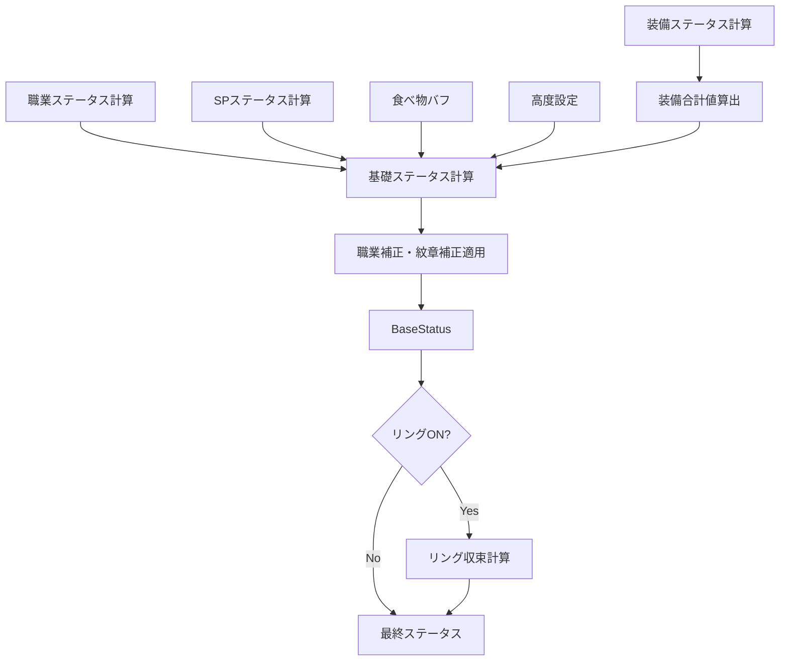

# 02_ステータスシステム

**バージョン**: 1.0
**最終更新日**: 2025-11-22

## 1. ステータスの種類と定義

### 1.1 全ステータス一覧（日英対応表）

| 日本語 | 英語（CSV） | 英語（YAML） | User接頭辞 | 説明 |
|:---|:---|:---|:---|:---|
| 体力 | HP | HP | UserHP | キャラクターの最大HP |
| 力 | 力 | Power | UserPower | 物理攻撃力に影響 |
| 魔力 | 魔力 | Magic | UserMagic | 魔法攻撃力に影響 |
| 精神 | 精神 | Mind | UserMind | 魔法ダメージに影響 |
| 素早さ | 素早さ | Agility | UserAgility | 短剣ダメージに影響 |
| 器用さ | 器用さ | Dexterity, Dex | UserDex | 会心率に影響（×0.3） |
| 撃力 | - | CritDamage | UserCritDamage | **会心ダメージと同義** |
| 守備力 | 守備力 | Defence, Defense | UserDefense | 槍ダメージに影響、被ダメージ軽減 |
| 会心率 | - | CritR, CritRate | UserCritR | クリティカル発生確率 |
| 会心ダメージ | - | CritD, CritDamage | WeaponCritDamage | 武器の会心ダメージ倍率 |
| 攻撃力 | 攻撃力 | AttackP, AttackPower | WeaponAttackPower | 武器の基礎攻撃力 |
| ダメージ補正 | ダメージ補正 | DamageC, DamageCorrection | DamageCorrection | 武器のダメージ乗算係数 |

### 1.2 重要な注意事項

#### 1.2.1 撃力 = 会心ダメージ
- **撃力**はユーザーの所持する**会心ダメージ**に相当する
- 武器の計算式において`UserCritDamage`として参照される
- CSVには「撃力」として記載されているが、内部的には会心ダメージとして扱う

#### 1.2.2 User接頭辞の意味
- **Userプレフィックス付き**: ユーザーの最終的な総合ステータス
  - 例: `UserPower`, `UserMagic`, `UserCritDamage`
- **Userプレフィックスなし**: 各装備のステータス
  - 例: `Initial.Power`, `Forge.Power`, `Rank.Bonus.AttackP`

#### 1.2.3 会心率の計算
会心率は以下の計算式で求められる:

```
会心率 = 武器会心率 + 器用さ × 0.3
```

- `武器会心率`: 武器CSVの「会心率（初期値）」+ ランクボーナス + 錬金 + 強化 + 叩き
- `器用さ`: ユーザーの最終的な器用さ（UserDex）

## 2. ステータス計算フロー

### 2.1 全体フロー



### 2.2 装備ステータス計算

各装備カテゴリごとに異なる計算式を適用する。

#### 2.2.1 武器（Weapon）

**会心率（CritR）**:
```
CritR = Initial.CritR + Rank.Bonus.CritR + Rank.Alchemy.CritR
        + Reinforcement.CritR × <ReinforcementLevel>
        + Forge.CritR × <ForgeCritRAmount>
```

**会心ダメージ（CritD）**:
```
CritD = Initial.CritD + Rank.Bonus.CritD + Rank.Alchemy.CritD
        + Reinforcement.CritD × <ReinforcementLevel>
        + Forge.CritD × <ForgeCritDAmount>
```

**攻撃力（AttackP）**:
```
AttackP = ROUNDUP( Initial.AttackP + AvailableLv × (Rank.Bonus.AttackP / Denominator) )
          + Rank.Bonus.AttackP + Rank.Alchemy.AttackP
          + Reinforcement.AttackP × <ReinforcementLevel>
          + Forge.AttackP × <ForgeAttackPAmount>
```

**ダメージ補正（DamageC）**:
```
DamageC = Initial.DamageC + Rank.Bonus.DamageC
```

**クールタイム（CoolT）**:
```
CoolT = Initial.CoolT + Rank.Bonus.CoolT
```

##### 変数の説明:
- `Initial.*`: CSVの「初期値」列の値
- `Rank.Bonus.*`: EqConst.yaml の `Weapon.Rank.<Rank>.Bonus.*`
- `Rank.Alchemy.*`: EqConst.yaml の `Weapon.Rank.<Rank>.Alchemy.*`（錬金ON時のみ加算）
- `Reinforcement.*`: EqConst.yaml の `Weapon.Reinforcement.*`
- `<ReinforcementLevel>`: 強化値（0〜80）
- `Forge.*`: EqConst.yaml の `Weapon.Forge.*`
- `<ForgeAttackPAmount>`: 攻撃力の叩き回数
- `AvailableLv`: CSVの「使用可能Lv」
- `Denominator`: EqConst.yaml の `Weapon.Reinforcement.Denominator` (320)

##### 武器ランクの特殊処理:
- CSVの「最低ランク」が**空白**の場合: SSS〜Fすべてのランクが利用可能
- CSVの「最低ランク」が**指定されている場合**:
  - CSVのデータは最低ランクの値を示す
  - Fランクの値を逆算する必要がある
  - 逆算式: `F値 = 最低ランク値 - (Rank.Bonus.<Stat> の累積差分)`
  - 小数点は四捨五入

#### 2.2.2 防具（Armor）

**メインステータス（守備力、その他）**:
```
MainStatus = ROUND(
    (Initial.<Stat> + Forge.<Stat> × <ForgeCount>)
    × (1 + (Initial.<Stat> + Forge.<Stat> × <ForgeCount>)^0.2 × (Bonus.Rank / AvailableLv))
)
```

##### 変数の説明:
- `Initial.<Stat>`: CSVの初期値
- `Forge.<Stat>`: EqConst.yaml の `Armor.Forge.*`
  - `Defence`: 1
  - `Other`: 2
- `<ForgeCount>`: 叩き回数
- `Bonus.Rank`: EqConst.yaml の `Armor.Rank.<Rank>`（ランクの係数）
  - SSS: 8, SS: 7, S: 6, A: 5, B: 4, C: 3, D: 2, E: 1, F: 0
- `AvailableLv`: CSVの「使用可能Lv」

##### 強化（Reinforcement）:
- 強化最大値: 40
- 計算式:
  - `Defence`: `Initial.Defence + Reinforcement.Defence × <ReinforcementLevel>`
  - `Other`: `Initial.Other + Reinforcement.Other × <ReinforcementLevel>`
- EqConst.yaml定義:
  - `Reinforcement.Defence`: 1
  - `Reinforcement.Other`: 2

#### 2.2.3 アクセサリー（Jewel）

**メインステータス**:
```
MainStatus = ROUNDUP( Initial.<Stat> + AvailableLv × Rank.<Stat> / 550 )
```

##### 変数の説明:
- `Initial.<Stat>`: CSVの初期値
- `Rank.<Stat>`: EqConst.yaml の `Accessory.Rank.<Rank>`
  - SSS: 55, SS: 50, S: 45, A: 44, B: 44, C: 35, D: 35, E: 0, F: 0
- `AvailableLv`: CSVの「使用可能Lv」

##### 注意事項:
- アクセサリーには**叩き（Forge）はない**
- **強化（Reinforcement）もない**

#### 2.2.4 EX装備（Equipment_EX）

EX装備は防具とアクセサリーの特殊なステータスを指す。

**実際の値（RealValue）**:
```
RealValue = ROUND( AvailableLv × Rank.<Stat> + 1 )
```

##### EqConst.yamlの定義:
```yaml
Equipment_EX:
  Rank:
    CritR:          # 会心率
      SSS: 0.15
      SS: 0.13
      ...
    Speed_CritD:    # 素早さ・会心ダメージ
      SSS: 0.6
      SS: 0.5
      ...
    Other:          # その他ステータス
      SSS: 0.7
      SS: 0.6
      ...
```

##### 適用対象:
- 防具・アクセサリーのCSVに**EX列**が存在する場合に適用
- 会心率、素早さ、撃力などの特殊ステータス

### 2.3 職業ステータス計算

#### 2.3.1 初期値（Job.Initial）

職業CSVの「初期値」行に定義されたステータス。

**計算式**:
```
Job.Initial.<Stat> × <JobLevel>
```

##### レベル成長の仕様:
- **初期レベル**: レベル1
- **初期値行の値**: レベル1時点での値
  - 例: 体力の初期値が10 → レベル1で体力10
- **レベル成長**:
  - **力、魔力、体力、精神**: `初期値 × レベル`で計算
    - レベル1: 初期値 × 1
    - レベル2: 初期値 × 2
    - レベル10: 初期値 × 10
  - **その他のステータス**: 初期値行に定義された値から変化しない

**具体例**（初期値: 体力10の場合）:
| レベル | 体力 |
|:---:|---:|
| 1 | 10 |
| 2 | 20 |
| 10 | 100 |

#### 2.3.2 SPステータス（Job.SP）

SPツリーで取得したステータス。

**取得方法**:
- 職業CSVの各行（A-1, B-1, C-1など）に定義されたステータスを累積加算
- 必要SPを満たした段階まで取得可能

**SP獲得方法**:
```
SP = レベル × 2
```

##### SPツリーの仕様:
- A系統、B系統、C系統の3系統が存在
- **同時進行可能**: 3系統すべてに並行してSPを投資できる
- **順序制約**: 各系統内では上から順に取得する必要がある
  - 例: A-3を取得するには、A-1とA-2を先に取得する必要がある
- **必要SP**: 累計値
  - 例: A-3の必要SPが13の場合、A-1からA-3までの合計SPが13必要

#### 2.3.3 職業補正（Job.Bonus）

職業CSVの「職業補正(%)」行に定義された%補正。

**適用方法**:
```
(BaseStatus) × (1 + Job.Bonus.<Stat>/100 + Emblem.Bonus.<Stat>/100)
```

##### 注意事項:
- 職業CSVでは空欄の場合があるが、システム内部では0として扱う
- 紋章の%補正と合算される

### 2.4 紋章・ルーンストーンのステータス

#### 2.4.1 紋章（Emblem）

**ステータス加算**:
- 紋章CSVの「力（%不要）」「魔力（%不要）」などの列の値
- これらは**%ボーナス**として`Emblem.Bonus.<Stat>`に加算される

**計算式**:
```
(BaseStatus) × (1 + Emblem.Bonus.<Stat>/100)
```

#### 2.4.2 ルーンストーン（RuneStone）

**グレード制限**:
- ノーマル、グレート、バスター、レプリカの4グレードが存在
- **各グレードから1個ずつまで**装備可能（合計最大4個）

**耐性の定義**:
- ルーンCSVの「耐性1〜6」列に定義
- 形式: `属性名, 値`（例: `水, 15`）
- 意味: その属性の耐性を+15%
- 値が存在するもののみ定義される

**ステータスへの影響**:
- ルーンストーンのステータスは装備合計値（SumEquipment）に加算される

### 2.5 食べ物バフ（Food）

**適用方法**:
```
BaseStatus = (SumEquipment + Job.Initial×Lv + Job.SP + Food + UserOption) × (...)
```

**制約**:
- **1つのみ**選択可能
- 固定値として加算される（%補正ではない）

### 2.6 高度設定（UserOption）

**手動ステータス調整**:
- `UserOption.<Stat>`: ±の整数値で自由に調整可能
- BaseStatusの加算項に含まれる

**武器固有能力**:
- 対応する武器種が装備されている場合のみ有効
- 対応しない武器の場合は自動OFF + グレーアウト
- 効果はUserOptionまたはJob.Bonusに加算

### 2.7 基礎ステータス（BaseStatus）

全ての要素を統合した基礎ステータス。

**計算式**:
```
BaseStatus = (SumEquipment.<Stat> + Job.Initial.<Stat> × <JobLevel> + Job.SP.<Stat> + Food.<Stat> + UserOption.<Stat>)
             × (1 + Job.Bonus.<Stat>/100 + Emblem.Bonus.<Stat>/100)
```

### 2.8 リング収束計算（Ring）

リングがONの場合、BaseStatusに対して反復計算を行う。

**計算式**:
```
repeat(
    round( CurrentStatus × (1 + Ring.<Stat>/100) ),
    until_converged
)
```

**収束条件**:
- 計算結果が変化しなくなるまで繰り返す
- 最大反復回数: 100回（無限ループ防止）

**リング装備数**:
- **1個のみ**装備可能

### 2.9 最終ステータス

リング収束計算後の値が最終ステータスとなる。

## 3. ステータス表示

### 3.1 表示項目

キャラビルドページで以下のステータスを表示:

| ステータス | 説明 |
|:---|:---|
| HP | 最大HP |
| MP | 最大MP |
| 力 | 物理攻撃力 |
| 魔力 | 魔法攻撃力 |
| 精神 | 魔法ダメージ補正 |
| 素早さ | 短剣ダメージ補正 |
| 器用さ | 会心率に影響 |
| 守備力 | 槍ダメージ補正、被ダメージ軽減 |
| 撃力 | 会心ダメージ |
| 会心率 | クリティカル発生確率 |

### 3.2 内訳ツールチップ

各ステータスにマウスオーバーすると、以下の内訳を表示:

- 装備合計
- 職業初期値（レベル分）
- SP
- Food
- UserOption
- 職業補正（%）
- 紋章補正（%）
- リング補正（収束後）

**表示例**:
```
力: 150
┣━ 装備合計: 80
┣━ 職業初期値: 20 (Lv 20)
┣━ SP: 30
┣━ Food: 10
┣━ UserOption: 0
┣━ 職業補正: +10% (11)
┗━ リング収束: +2
```

## 4. バリデーション

### 4.1 入力値の検証

| 項目 | 制約 |
|:---|:---|
| レベル | 1 〜 JobDefinition.<Job>.MaxLevel |
| SP | 0 〜 レベル×2 |
| 強化値（武器） | 0 〜 80 |
| 強化値（防具） | 0 〜 40 |
| 叩き回数 | 0 〜 999 |
| UserOption | -9999 〜 9999 |

### 4.2 エラー表示

**SP超過エラー**:
- 赤枠 + エラーメッセージ「SPが上限を超えています」
- ステータス計算は直前の有効値を維持

**装備レベル不足**:
- 装備をグレーアウト
- 選択時にエラーメッセージ「レベルが不足しています」

**ルーングレード重複**:
- 赤枠 + 警告メッセージ「同じグレードのルーンは1つまでです」
- 火力計算・最適化ボタンをdisabled

## 5. 改訂履歴

| 版 | 日付 | 変更内容 | 担当者 |
|:---|:---|:---|:---|
| 1.1 | 2025-11-22 | Q1-3の回答を反映: 職業レベル成長の詳細を追加 | Claude |
| 1.0 | 2025-11-22 | 初版作成 | Claude |
