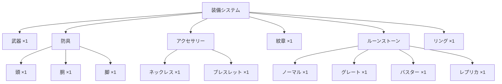

# 03_装備システム

**バージョン**: 1.0
**最終更新日**: 2025-11-22

## 1. 装備スロット構成

### 1.1 装備可能スロット



### 1.2 スロット詳細

| スロット | 装備数 | 強化 | 叩き | 錬金 | 備考 |
|:---|:---:|:---:|:---:|:---:|:---|
| 武器 | 1 | 0〜80 | ○ | ○ | 武器種により職業制限あり |
| 頭 | 1 | 0〜40 | ○ | - | 防具種により職業制限あり |
| 胴 | 1 | 0〜40 | ○ | - | 防具種により職業制限あり |
| 脚 | 1 | 0〜40 | ○ | - | 防具種により職業制限あり |
| ネックレス | 1 | - | - | - | - |
| ブレスレット | 1 | - | - | - | - |
| 紋章 | 1 | - | - | - | %補正を提供 |
| ルーンストーン | 4 | - | - | - | グレードごとに1個まで |
| リング | 1 | - | - | - | 未実装だが考慮 |

## 2. 武器システム

### 2.1 武器CSVの構造

| 列名 | 型 | 説明 |
|:---|:---|:---|
| アイテム名 | string | 武器の名称 |
| 制作 | boolean | 制作可能かどうか |
| 武器種 | string | 剣/斧/杖/弓/大剣/短剣/槍/フライパン |
| 使用可能Lv | number | 装備に必要なレベル |
| 攻撃力（初期値） | number | 基礎攻撃力 |
| 会心率（初期値） | number | 基礎会心率 |
| 会心ダメージ（初期値） | number | 基礎会心ダメージ |
| ダメージ補正（初期値） | number | 基礎ダメージ補正（%） |
| ct(初期値) | number | クールタイム（秒） |
| 最低ランク | string | 最低ランク（空白可） |
| 最高ランク | string | 最高ランク（空白可） |

### 2.2 武器ランクシステム

#### 2.2.1 ランク一覧
SSS > SS > S > A > B > C > D > E > F （9段階）

#### 2.2.2 ランク範囲の決定

**CSVの「最低ランク」「最高ランク」が空白の場合**:
- すべてのランク（SSS〜F）が利用可能

**CSVの「最低ランク」が指定されている場合**:
- 指定されたランク以上のみ利用可能
- 例: 最低ランク「A」→ SSS, SS, S, A のみ

**CSVの「最高ランク」が指定されている場合**:
- 指定されたランク以下のみ利用可能
- 例: 最高ランク「C」→ F, E, D, C のみ

#### 2.2.3 最低ランク指定時のF基準逆算

**問題**:
- CSVのデータは「最低ランク」の値を示している
- しかし、計算式はF基準で定義されている

**解決方法**:
CSVデータからFランクの値を逆算する処理を実装する。

**逆算対象**:
- **すべてのステータス**を逆算する
  - 攻撃力（AttackP）
  - 会心率（CritR）
  - 会心ダメージ（CritD）
  - クールタイム（CoolT）
  - その他すべての定義されたステータス

**逆算式**:
```
F_value = CSV_value - Rank.Bonus.<Stat>[最低ランク]
```

**計算の導出**:
1. 武器のステータス計算定義（EqConst.yaml の Weapon.Rank）を参照
2. 各ランクのボーナス値を取得
3. 最低ランクのボーナスを引いてFランク基準値を算出

**具体例**:
- CSVデータ: 攻撃力 100、会心率 10（最低ランクA）
- EqConst.yaml:
  - Rank.Bonus.AttackP (A): 25, (F): 0
  - Rank.Bonus.CritR (A): 5, (F): 0
- 逆算:
  - F_AttackP = 100 - 25 = 75
  - F_CritR = 10 - 5 = 5
- 結果:
  - F: 攻撃力 75, 会心率 5
  - A: 攻撃力 100, 会心率 10
  - SSS: 攻撃力 106, 会心率 16

**注意事項**:
- 小数点の値は四捨五入
- 逆算は強化・叩き・錬金を除いた基礎値で行う
- すべてのステータスで個別に逆算処理を実施

### 2.3 武器の計算式

詳細は「02_ステータスシステム.md」の2.2.1を参照。

**要約**:
```
AttackP = ROUNDUP( Initial.AttackP + AvailableLv × (Rank.Bonus.AttackP / 320) )
          + Rank.Bonus.AttackP + Rank.Alchemy.AttackP
          + Reinforcement.AttackP × <強化値>
          + Forge.AttackP × <叩き回数>
```

### 2.4 強化システム（Reinforcement）

#### 2.4.1 強化値の範囲
- 武器: 0〜80
- 防具: 0〜40

#### 2.4.2 強化による上昇値

**武器**（EqConst.yaml の Weapon.Reinforcement）:
| ステータス | 1強化あたり |
|:---|:---|
| 攻撃力（AttackP） | 2 |
| 会心ダメージ（CritD） | 1 |
| 会心率（CritR） | 0 |

**防具**（EqConst.yaml の Armor.Reinforcement）:
| ステータス | 1強化あたり |
|:---|:---|
| 守備力（Defence） | 1 |
| その他（Other） | 2 |

### 2.5 叩きシステム（Forge）

#### 2.5.1 叩きの概念
各ステータスを個別に強化するシステム。

#### 2.5.2 叩きによる上昇値

**武器**（EqConst.yaml の Weapon.Forge）:
| ステータス | 1回あたり |
|:---|:---|
| その他（Other） | 1 |

**防具**（EqConst.yaml の Armor.Forge）:
| ステータス | 1回あたり |
|:---|:---|
| 守備力（Defence） | 1 |
| その他（Other） | 2 |

#### 2.5.3 UI仕様
- 「叩きON」チェックボックスで詳細欄を展開
- 各ステータスごとに叩き回数を個別に指定
- 叩き回数の上限: 999（実用上の制限）

### 2.6 錬金システム（Alchemy）

#### 2.6.1 錬金の概念
装備ランクに応じた追加ボーナスを付与するシステム。

#### 2.6.2 錬金の有効化
- トグルスイッチでON/OFF
- ONの場合のみ `Rank.Alchemy.*` が加算される

#### 2.6.3 ランクごとの錬金値

**武器**（EqConst.yaml の Weapon.Rank.<Rank>.Alchemy）:
| ランク | AttackP | CritD | CritR |
|:---|---:|---:|---:|
| SSS | 118 | 48 | 11 |
| SS | 117 | 47 | 10 |
| S | 117 | 47 | 10 |
| A | 116 | 47 | 9 |
| B | 116 | 47 | 9 |
| C | 114 | 47 | 8 |
| D | 114 | 47 | 8 |
| E | 113 | 46 | 7 |
| F | 113 | 46 | 7 |

**防具・アクセサリー**:
- 錬金システムなし

## 3. 防具システム

### 3.1 防具CSVの構造

| 列名 | 型 | 説明 |
|:---|:---|:---|
| アイテム名 | string | 防具の名称 |
| 部位 | string | 頭/胴/脚 |
| 防具種 | string | 軽/重/布/特殊 |
| 使用可能Lv | number | 装備に必要なレベル |
| 守備力（初期値） | number | 基礎守備力 |
| その他ステータス | number | 力/魔力/体力など |
| ランク | string | SSS〜F |

### 3.2 防具の計算式

詳細は「02_ステータスシステム.md」の2.2.2を参照。

**要約**:
```
MainStatus = ROUND(
    (Initial.<Stat> + Forge.<Stat> × <叩き回数>)
    × (1 + (Initial.<Stat> + Forge.<Stat> × <叩き回数>)^0.2 × (Bonus.Rank / AvailableLv))
)
```

**Bonus.Rank**（EqConst.yaml の Armor.Rank）:
| ランク | 係数 |
|:---|---:|
| SSS | 8 |
| SS | 7 |
| S | 6 |
| A | 5 |
| B | 4 |
| C | 3 |
| D | 2 |
| E | 1 |
| F | 0 |

### 3.3 防具の職業制限

各職業は特定の防具種のみ装備可能。

**例**（JobConst.yaml の JobDefinition.<Job>.AvailableArmors）:
```yaml
Novice:
  AvailableArmors: ["軽", "重", "布"]
Wizard:
  AvailableArmors: ["布"]
```

## 4. アクセサリーシステム

### 4.1 アクセサリーCSVの構造

| 列名 | 型 | 説明 |
|:---|:---|:---|
| アイテム名 | string | アクセサリーの名称 |
| 種類 | string | ネックレス/ブレスレット |
| 使用可能Lv | number | 装備に必要なレベル |
| ステータス（初期値） | number | 力/魔力/体力など |
| ランク | string | SSS〜F |

### 4.2 アクセサリーの計算式

詳細は「02_ステータスシステム.md」の2.2.3を参照。

**要約**:
```
MainStatus = ROUNDUP( Initial.<Stat> + AvailableLv × Rank.<Stat> / 550 )
```

**Rank係数**（EqConst.yaml の Accessory.Rank）:
| ランク | 係数 |
|:---|---:|
| SSS | 55 |
| SS | 50 |
| S | 45 |
| A | 44 |
| B | 44 |
| C | 35 |
| D | 35 |
| E | 0 |
| F | 0 |

**計算式の修正(2025-11-22)**:
- UserStatusCalc.yamlに誤って `Forge.<Stat>` と記載されていた箇所は `Rank.<Stat>` が正しい
- 正しい計算式: `ROUNDUP(Initial.<Stat> + AvailableLv * Rank.<Stat> / 550)`

### 4.3 注意事項
- アクセサリーには**強化なし**
- アクセサリーには**叩きなし**

## 5. 紋章システム

### 5.1 紋章CSVの構造

| 列名 | 型 | 説明 |
|:---|:---|:---|
| アイテム名 | string | 紋章の名称 |
| 力（%不要） | number | 力の%ボーナス |
| 魔力（%不要） | number | 魔力の%ボーナス |
| その他 | number | 他のステータスの%ボーナス |

### 5.2 紋章の効果

**重要**: 列名が「%不要」となっているが、これらは**%ボーナス**として扱う。

**適用方法**:
```
BaseStatus × (1 + Job.Bonus.<Stat>/100 + Emblem.Bonus.<Stat>/100)
```

**例**:
- CSV: 力（%不要）= 10
- 解釈: 力に+10%のボーナス
- 適用: BaseStatus × (1 + 10/100) = BaseStatus × 1.1

### 5.3 職業補正との関係

紋章の%補正と職業補正の%は合算される。

**計算式**:
```
FinalStatus = BaseStatus × (1 + (Job.Bonus + Emblem.Bonus) / 100)
```

**例**:
- BaseStatus: 100
- Job.Bonus: 5%
- Emblem.Bonus: 10%
- FinalStatus: 100 × (1 + (5 + 10) / 100) = 115

## 6. ルーンストーンシステム

### 6.1 ルーンストーンCSVの構造

| 列名 | 型 | 説明 |
|:---|:---|:---|
| アイテム名 | string | ルーンストーンの名称 |
| グレード | string | ノーマル/グレート/バスター/レプリカ |
| ステータス | number | 力/魔力/体力など |
| 耐性1〜6 | string | 属性名, 値 |

### 6.2 グレード制限

**重要**: 各グレードから1個ずつまで装備可能。

**装備可能数**:
- ノーマル: 1個
- グレート: 1個
- バスター: 1個
- レプリカ: 1個
- **合計最大**: 4個

### 6.3 耐性の定義

**形式**: `属性名, 値`

**例**:
- 耐性1: `水, 15`
- 耐性2: `火, 10`

**意味**:
- 水耐性 +15%
- 火耐性 +10%

**バリデーション**:
- 値が存在するもののみ定義される
- 空欄の場合は無視

### 6.4 ステータスへの影響

ルーンストーンのステータスは`SumEquipment`に加算される。

### 6.5 火力計算への影響

**重要**: 耐性は自分の耐性なので、火力計算には考慮しない。

## 7. リングシステム

### 7.1 現状
- **未実装**だが考慮が必要
- CSVデータは存在しない

### 7.2 仕様（予定）

**装備数**: 1個のみ

**効果**: %補正による収束計算

**計算式**:
```
repeat(
    round( CurrentStatus × (1 + Ring.<Stat>/100) ),
    until_converged
)
```

詳細は「02_ステータスシステム.md」の2.8を参照。

### 7.3 実装時の考慮事項
- リングCSVの構造定義
- UI上のトグルスイッチ
- 収束計算の最大反復回数制限

## 8. 装備UI仕様

### 8.1 装備選択UI

```
┌─────────────────────────────────────┐
│ [武器]                              │
│ ┌────────────────┐                  │
│ │ ウッドソード   │ ▼               │
│ └────────────────┘                  │
│                                     │
│ ランク: [SSS][SS][S][A][B][C][D][E][F]│
│                                     │
│ 強化値: [0] ⯇ ▬▬▬▬▬▬▬▬▬▬▬ ⯈ [80]     │
│                                     │
│ ☐ 叩きON                            │
│   ├─ 攻撃力: [0]                   │
│   ├─ 会心率: [0]                   │
│   └─ 会心ダメージ: [0]             │
│                                     │
│ ☐ 錬金ON                            │
│                                     │
│ 使用可能Lv: 32                      │
└─────────────────────────────────────┘
```

### 8.2 装備フィルタリング

**職業による自動フィルタ**:
- 装備できない武器種/防具種は候補に表示しない

**レベルによる制限**:
- 使用可能レベルを満たさない装備はグレーアウト
- 選択時にエラーメッセージ

### 8.3 装備ステータス表示

装備選択時に以下を表示:
- 基礎ステータス
- ランクボーナス
- 強化による上昇
- 叩きによる上昇
- 錬金による上昇
- **最終値**

**表示例**:
```
攻撃力: 250
┣━ 基礎値: 100
┣━ ランクボーナス: 31 (SSS)
┣━ 強化: 80 (40強化 × 2)
┣━ 叩き: 20 (20回)
┗━ 錬金: 19 (SSS)
```

## 9. バリデーション

### 9.1 装備レベル制限
- 使用可能レベル > キャラレベル → 選択不可

### 9.2 ルーングレード重複
- 同じグレードのルーンを2個以上選択 → エラー
- エラーメッセージ: 「同じグレードのルーンは1つまでです」
- 火力計算・最適化ボタンをdisabled

### 9.3 職業装備制限
- 職業が装備できない武器種/防具種 → 候補に表示しない

## 10. 改訂履歴

| 版 | 日付 | 変更内容 | 担当者 |
|:---|:---|:---|:---|
| 1.1 | 2025-11-22 | Q2-1, Q2-4の回答を反映: 武器ランク逆算の詳細化、アクセサリー計算式の修正 | Claude |
| 1.0 | 2025-11-22 | 初版作成 | Claude |
