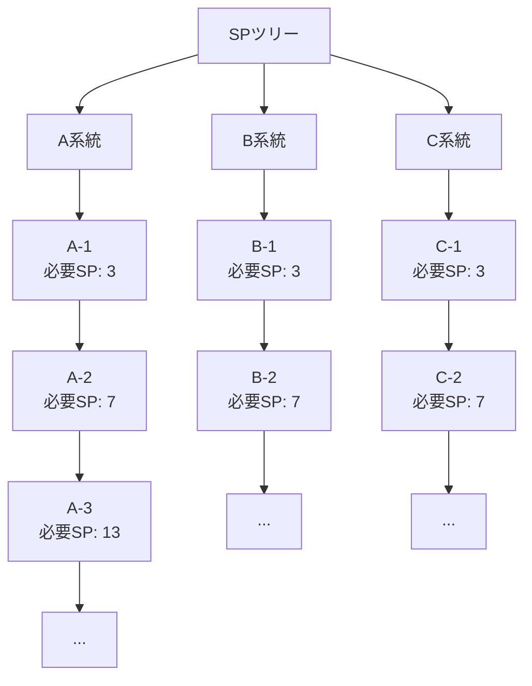

# 04_職業SPシステム

**バージョン**: 1.0
**最終更新日**: 2025-11-22

## 1. 職業システム

### 1.1 職業の定義

職業は以下の要素で定義される:
- 職業名
- 最大レベル
- 装備可能な武器種
- 装備可能な防具種
- SPツリー
- 初期ステータス
- レベルアップによるステータス成長
- 職業補正（%）

### 1.2 職業CSVの構造

| 列名 | 型 | 説明 |
|:---|:---|:---|
| 解法段階 | string | SPツリーの段階（A-1, B-2など）または「初期値」「職業補正(%)」 |
| 必要SP | number | その段階までの累計SP |
| 解法スキル名 | string | その段階で解法されるスキル名 |
| 体力 | number | 体力のステータス値 |
| 力 | number | 力のステータス値 |
| 魔力 | number | 魔力のステータス値 |
| 精神 | number | 精神のステータス値 |
| 素早さ | number | 素早さのステータス値 |
| 器用さ | number | 器用さのステータス値 |
| 撃力 | number | 撃力（会心ダメージ）のステータス値 |
| 守備力 | number | 守備力のステータス値 |
| 耐性（複数列） | number | 各種耐性のステータス値 |

### 1.3 特殊行の意味

#### 1.3.1 「初期値」行
```csv
初期値,,,10,,,10,,,,,,,,,,,,,
```

**意味**:
- レベル1時の基礎ステータス
- この例では体力10、精神10からスタート

**レベルアップでの成長**:
- **力、魔力、体力、精神**: レベルごとに+1
- **その他のステータス**: 成長しない（初期値のまま）

**計算式**:
```
Job.Initial.<Stat> × <JobLevel>
```

**例**（レベル20の場合）:
- 力の初期値が0の場合:
  - Job.Initial.Power = 0
  - レベル20での力: 0 × 20 = 0
  - しかし、レベルアップで+1ずつなので: 20
- 体力の初期値が10の場合:
  - Job.Initial.HP = 10
  - レベル20での体力: 10 + (20 - 1) = 29

**実装時の注意**:
- CSVの初期値はあくまで「基準値」
- 実際の計算では、力/魔力/体力/精神は「レベル×1」で計算
- 初期値が0でない場合は、その値を基準にレベル分を加算

#### 1.3.2 「職業補正(%)」行
```csv
職業補正(%),,,,,,,,,,,,,,,,,,,
```

**意味**:
- 職業固有の%補正
- 空欄の場合が多いが、システム内部では0として扱う

**適用方法**:
```
BaseStatus × (1 + Job.Bonus.<Stat>/100 + Emblem.Bonus.<Stat>/100)
```

**紋章との関係**:
- 職業補正(%)と紋章の%補正は合算される
- 例: 職業補正5% + 紋章補正10% = 合計15%

## 2. SPシステム

### 2.1 SP獲得方法

```
SP = レベル × 2
```

**例**:
- レベル1: 2 SP
- レベル10: 20 SP
- レベル50: 100 SP
- レベル100: 200 SP

### 2.2 職業レベルの最大値

職業ごとに最大レベルが異なる（JobConst.yaml の JobDefinition.<Job>.MaxLevel）。

**例**:
```yaml
Novice:
  MaxLevel: 50
Wizard:
  MaxLevel: 80
```

### 2.3 最大SP量

```
最大SP = 職業の最大レベル × 2
```

**例**:
- Novice（Lv50まで）: 100 SP
- Wizard（Lv80まで）: 160 SP

## 3. SPツリー

### 3.1 SPツリーの構造



### 3.2 系統の並行進行

**重要**: A系統、B系統、C系統は**同時進行可能**。

**例**:
- A系統にSP 10を投資
- B系統にSP 15を投資
- C系統にSP 5を投資
- 合計: 30 SP

### 3.3 順序制約

**重要**: 各系統内では**上から順に取得**する必要がある。

**取得可能な例**:
- A-1を取得
- A-2を取得（A-1を先に取得済み）
- B-1を取得（系統が異なるので独立）

**取得不可の例**:
- A-3を取得（A-2を未取得）→ エラー
- B-5を取得（B-1〜B-4のいずれかを未取得）→ エラー

### 3.4 必要SPの意味

**重要**: 必要SPは**累計値**。

**例**（ノービスのA系統）:
```csv
A-1, 3, ...     → A系統に累計3SP投資で取得
A-2, 7, ...     → A系統に累計7SP投資で取得
A-3, 13, ...    → A系統に累計13SP投資で取得
```

**計算方法**:
- A-1の取得: 3 SP（3 - 0）
- A-2の取得: 4 SP（7 - 3）
- A-3の取得: 6 SP（13 - 7）

### 3.5 SPツリーのUI仕様

```
┌─────────────────────────────────────┐
│ SP割り振り                          │
│ 合計SP: 50 / 100                    │
├─────────────────────────────────────┤
│ A系統: 20 SP                        │
│ ├─ ☑ A-1 (必要: 3)  力+5           │
│ ├─ ☑ A-2 (必要: 7)  器用さ+3       │
│ ├─ ☑ A-3 (必要: 13) 撃力+5         │
│ ├─ ☐ A-4 (必要: 19) 撃力+5         │
│ └─ ☐ A-5 (必要: 22) 体力+5         │
├─────────────────────────────────────┤
│ B系統: 15 SP                        │
│ ├─ ☑ B-1 (必要: 3)  力+5           │
│ ├─ ☑ B-2 (必要: 7)  器用さ+3       │
│ └─ ☐ B-3 (必要: 13) 体力+10        │
├─────────────────────────────────────┤
│ C系統: 15 SP                        │
│ ├─ ☑ C-1 (必要: 3)  魔力+5         │
│ ├─ ☑ C-2 (必要: 7)  精神+3         │
│ └─ ☐ C-3 (必要: 13) 魔力+10        │
└─────────────────────────────────────┘
```

**スライダー方式の代替UI**:
```
┌─────────────────────────────────────┐
│ A系統: [━━━━━━━━━━━━━━━━━━━━━━] 20   │
│ B系統: [━━━━━━━━━━━━━━━━] 15         │
│ C系統: [━━━━━━━━━━━━━━━━] 15         │
│ 残りSP: 50                          │
└─────────────────────────────────────┘
```

### 3.6 SPツリーのバリデーション

#### 3.6.1 SP超過エラー
```
合計SP > 最大SP
```

**エラー表示**:
- 赤枠 + エラーメッセージ「SPが上限を超えています」
- ステータス計算は直前の有効値を維持

#### 3.6.2 順序違反エラー
```
A-3を取得しようとしているが、A-2が未取得
```

**エラー表示**:
- A-3のチェックボックスをdisabled
- ツールチップ「A-2を先に取得してください」

## 4. 職業レベルによるステータス成長

### 4.1 成長ステータス

レベルアップで成長するステータス:
- 力: +1 / レベル
- 魔力: +1 / レベル
- 体力: +1 / レベル
- 精神: +1 / レベル

### 4.2 非成長ステータス

レベルアップしても変化しないステータス:
- 素早さ
- 器用さ
- 撃力
- 守備力
- 耐性

**これらはSPツリーや装備で増やす必要がある**。

### 4.3 計算例

**レベル20のノービス**（初期値: 体力10, 精神10）:
- 体力: 10 + 20 = 30
- 力: 0 + 20 = 20
- 魔力: 0 + 20 = 20
- 精神: 10 + 20 = 30

## 5. 解法スキル

### 5.1 解法スキルとは

SPツリーの特定段階で解法（アンロック）されるスキル。

### 5.2 解法条件

**CSVの「解法スキル名」列に記載されているスキルを取得するには**:
- その段階の必要SPを満たす必要がある

**例**（ノービスのA-6）:
```csv
A-6, 25, 応急手当, ...
```

**取得条件**:
- A系統に累計25SP投資
- A-1〜A-5を先に取得済み

### 5.3 スキルの使用

解法されたスキルは火力計算ページで選択可能になる。

## 6. 職業定数（JobConst.yaml）

### 6.1 JobDefinitionの構造

```yaml
JobDefinition:
  Novice:
    MaxLevel: 50
    AvailableWeapons: ["剣", "斧", "杖", "弓"]
    AvailableArmors: ["軽", "重", "布"]

  Wizard:
    MaxLevel: 80
    AvailableWeapons: ["杖"]
    AvailableArmors: ["布"]
```

### 6.2 装備制限の適用

#### 6.2.1 武器種制限
```
職業が装備できない武器種 → 候補に表示しない
```

**例**:
- Wizardは「杖」のみ
- 「剣」「斧」「弓」は選択肢に表示されない

#### 6.2.2 防具種制限
```
職業が装備できない防具種 → 候補に表示しない
```

**例**:
- Wizardは「布」のみ
- 「軽」「重」の防具は選択肢に表示されない

## 7. UI仕様

### 7.1 職業選択

```
┌─────────────────────────────────────┐
│ 職業: [ノービス        ] ▼         │
│ レベル: [20] ⯇ ▬▬▬▬▬▬▬▬▬▬▬ ⯈ [50] │
└─────────────────────────────────────┘
```

**職業変更時の動作**:
- レベル上限を新職業の MaxLevel に更新
- 現在レベルが上限を超える場合は上限に切り詰め
- 装備候補を新職業の AvailableWeapons / AvailableArmors でフィルタ
- SPツリーをリセット（または確認ダイアログ表示）

### 7.2 レベル入力

**範囲**: 1 〜 JobDefinition.<Job>.MaxLevel

**UI形式**:
- 数値入力フィールド
- スライダー
- ステッパー（±ボタン）

### 7.3 SP割り振り

詳細は「3.5 SPツリーのUI仕様」を参照。

## 8. ステータス計算への統合

### 8.1 職業ステータスの反映

```
BaseStatus = (SumEquipment.<Stat> + Job.Initial.<Stat> × <JobLevel> + Job.SP.<Stat> + Food.<Stat> + UserOption.<Stat>)
             × (1 + Job.Bonus.<Stat>/100 + Emblem.Bonus.<Stat>/100)
```

**内訳**:
- `Job.Initial.<Stat> × <JobLevel>`: 職業初期値 × レベル
  - 力/魔力/体力/精神: レベル×1
  - その他: 0（成長しない）
- `Job.SP.<Stat>`: SPツリーで取得したステータスの合計
- `Job.Bonus.<Stat>`: 職業補正(%)

### 8.2 計算例

**ノービス Lv 20、A系統20SP、B系統15SP投資**:

**職業初期値**:
- 力: 0 + 20 = 20
- 体力: 10 + 20 = 30

**SPによる追加**:
- A-1〜A-3取得: 力+5, 器用さ+3, 撃力+5
- B-1〜B-2取得: 力+5, 器用さ+3
- 合計: 力+10, 器用さ+6, 撃力+5

**最終的な職業由来のステータス**:
- 力: 20 + 10 = 30
- 体力: 30
- 器用さ: 0 + 6 = 6
- 撃力: 0 + 5 = 5

## 9. バリデーション

### 9.1 レベル範囲チェック
```
1 <= レベル <= JobDefinition.<Job>.MaxLevel
```

### 9.2 SP範囲チェック
```
0 <= 合計SP <= レベル × 2
```

### 9.3 SPツリー順序チェック
```
各系統内で、上から順に取得されているか
```

### 9.4 装備職業適合チェック
```
選択中の武器種 ∈ AvailableWeapons
選択中の防具種 ∈ AvailableArmors
```

## 10. 改訂履歴

| 版 | 日付 | 変更内容 | 担当者 |
|:---|:---|:---|:---|
| 1.0 | 2025-11-22 | 初版作成 | Claude |
