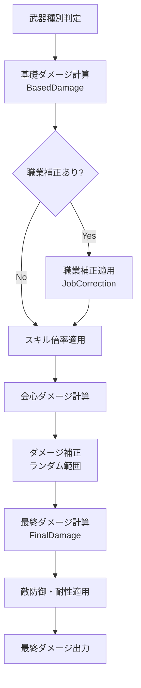

# 05_ダメージ計算

**バージョン**: 1.0
**最終更新日**: 2025-11-22

## 1. ダメージ計算の全体フロー



## 2. 基礎ダメージ計算（BasedDamage）

### 2.1 武器種別ごとの計算式

WeaponCalc.yaml の BasedDamage に定義されている。

#### 2.1.1 剣（Sword）
```
(WeaponAttackPower + UserPower × 1.6) × DamageCorrection × (1 + (WeaponCritDamage/100) + UserCritDamage × 0.005)
```

#### 2.1.2 杖（Wand）
```
(WeaponAttackPower + UserMagic × 1.75) × DamageCorrection × (1 + WeaponCritDamage/100 + UserCritDamage × 0.0016)
```

#### 2.1.3 弓（Bow）
```
(WeaponAttackPower + UserPower × 1.75) × DamageCorrection × (1 + WeaponCritDamage/100 + UserCritDamage × 0.0016)
```

#### 2.1.4 斧（Axe）
```
(WeaponAttackPower + UserPower × 1.5 + UserMind × 2.5) × DamageCorrection × (1 + WeaponCritDamage/100 + UserCritDamage × 0.001)
```

#### 2.1.5 大剣（GreatSword）
```
(WeaponAttackPower + UserPower × 1.6 + UserHP × 3.1) × DamageCorrection × (1 + WeaponCritDamage/100 + UserCritDamage × 0.001)
```

#### 2.1.6 短剣（Dagger）
```
(WeaponAttackPower + UserPower × 1.25 + UserAgility × 3.5) × DamageCorrection × (1 + WeaponCritDamage/100 + UserCritDamage × 0.0015)
```

#### 2.1.7 槍（Spear）
```
((((UserDex + WeaponCritRate + 100) × UserDefense × 8 / 300) + (UserPower / 200) + WeaponAttackPower) × DamageCorrection × (1 + (WeaponCritDamage/100 + UserCritDamage × 0.001) / 3))
```

#### 2.1.8 フライパン（Frypan）
```
round((WeaponAttackPower + UserPower × 1.6) × DamageCorrection × ComboCorrection × (1 + WeaponCritDamage/100 + UserCritDamage × 0.005)) / 2
```

### 2.2 変数の対応

| 変数名 | 説明 | 取得元 |
|:---|:---|:---|
| WeaponAttackPower | 武器の攻撃力 | 武器CSV「攻撃力（初期値）」+ ランク + 強化 + 叩き + 錬金 |
| UserPower | ユーザーの力 | UserStatusFormula.BaseStatus（リング収束後） |
| UserMagic | ユーザーの魔力 | UserStatusFormula.BaseStatus（リング収束後） |
| UserMind | ユーザーの精神 | UserStatusFormula.BaseStatus（リング収束後） |
| UserAgility | ユーザーの素早さ | UserStatusFormula.BaseStatus（リング収束後） |
| UserHP | ユーザーのHP | UserStatusFormula.BaseStatus（リング収束後） |
| UserDex | ユーザーの器用さ | UserStatusFormula.BaseStatus（リング収束後） |
| UserDefense | ユーザーの守備力 | UserStatusFormula.BaseStatus（リング収束後） |
| UserCritDamage | ユーザーの撃力（会心ダメージ） | UserStatusFormula.BaseStatus（リング収束後） |
| WeaponCritRate | 武器の会心率 | 武器CSV「会心率（初期値）」+ ランク + 強化 + 叩き + 錬金 |
| WeaponCritDamage | 武器の会心ダメージ | 武器CSV「会心ダメージ（初期値）」+ ランク + 錬金 |
| DamageCorrection | ダメージ補正 | 武器CSV「ダメージ補正（初期値）」/ 100 |
| ComboCorrection | コンボ補正 | フライパン専用（未定義の場合は1） |

### 2.3 ダメージ補正（DamageCorrection）

#### 2.3.1 基礎値
```
DamageCorrection = 武器CSV「ダメージ補正（初期値）」/ 100
```

**例**:
- CSV値: 80 → DamageCorrection = 0.8
- CSV値: 90 → DamageCorrection = 0.9

#### 2.3.2 ランダム範囲

**重要**: ダメージ補正は「ダメージ補正〜100%」のランダムダメージとなる。

**計算式**:
```
実際のDamageCorrection = random(基礎DamageCorrection, 1.0)
```

**例**（ダメージ補正80の武器）:
- 最小ダメージ: 基礎ダメージ × 0.8
- 最大ダメージ: 基礎ダメージ × 1.0
- ランダムで 0.8〜1.0 の範囲で決定

#### 2.3.3 UI上の扱い

**火力計算ページでの選択肢**:
1. **最小ダメージ**: DamageCorrection = 基礎値
2. **最大ダメージ**: DamageCorrection = 1.0
3. **平均ダメージ**: DamageCorrection = (基礎値 + 1.0) / 2

## 3. 職業補正（JobCorrection）

### 3.1 職業補正の適用

特定の職業では、武器種別ごとに独自の計算式が定義されている。

**適用順序**:
1. 基礎ダメージ（BasedDamage）を計算
2. 職業補正（JobCorrection）がある場合は上書き

### 3.2 ノービス（Novice）の補正

WeaponCalc.yaml の JobCorrection.Novice に定義されている。

#### 3.2.1 剣（Sword）
```
(UserPower × 1.6 + WeaponAttackPower) × DamageCorrection × (1 + WeaponCritDamage/100 + UserCritDamage × 0.005)
```

#### 3.2.2 杖（Wand）
```
(UserMagic × 1.75 + WeaponAttackPower) × DamageCorrection × (1 + WeaponCritDamage/100 + UserCritDamage × 0.0016)
```

#### 3.2.3 弓（Bow）
```
(UserPower × 1.3 + WeaponAttackPower) × DamageCorrection × (1 + WeaponCritDamage/100 + UserCritDamage × 0.0016)
```

#### 3.2.4 斧（Axe）
```
(UserPower × 1.8 + WeaponAttackPower) × DamageCorrection × (1 + WeaponCritDamage/100 + UserCritDamage × 0.001)
```

#### 3.2.5 大剣（GreatSword）
```
(UserPower × 1.8 + WeaponAttackPower) × DamageCorrection × (1 + WeaponCritDamage/100 + UserCritDamage × 0.001)
```

#### 3.2.6 短剣（Dagger）
```
(UserPower × 1.5 + WeaponAttackPower) × DamageCorrection × (1 + WeaponCritDamage/100 + UserCritDamage × 0.0015)
```

#### 3.2.7 槍（Spear）
```
(UserPower × 1.8 + WeaponAttackPower) × DamageCorrection × (1 + (WeaponCritDamage/100 + UserCritDamage × 0.001)/3)
```

### 3.3 スペルリファクター（SpellRefactor）の補正

```yaml
SpellRefactor:
  Bonus: "0.75 - round(0.475 × ln(max(UserPower, UserMagic) / min(UserPower, UserMagic)), 2) × 2"
```

**意味**:
- 力と魔力のバランスによってボーナスが変動
- 力と魔力が均等な場合に最大ボーナス
- 偏りが大きいほどペナルティ

## 4. 会心率・会心ダメージ計算

### 4.1 会心率の計算

```
会心率 = 武器会心率 + 器用さ × 0.3
```

**変数**:
- `武器会心率`: WeaponCritRate
- `器用さ`: UserDex

**例**:
- 武器会心率: 10
- 器用さ: 50
- 会心率: 10 + 50 × 0.3 = 25%

### 4.2 会心ダメージの適用オプション

**重要**: 会心率の考慮方法を3つのオプションから選択可能。

#### 4.2.1 会心100%モード
```
最終ダメージ = 基礎ダメージ × 会心ダメージ倍率
```

**用途**: 会心が確定で発生する場合のダメージ

#### 4.2.2 会心0%モード
```
最終ダメージ = 基礎ダメージ
```

**用途**: 会心が発生しない場合のダメージ

#### 4.2.3 期待値モード
```
最終ダメージ = 基礎ダメージ × (1 + 会心率 × 会心ダメージ倍率)
```

**用途**: 平均的なダメージの算出

**例**（会心率25%、会心ダメージ50%の場合）:
- 基礎ダメージ: 1000
- 期待ダメージ: 1000 × (1 + 0.25 × 0.5) = 1000 × 1.125 = 1125

### 4.3 会心ダメージ倍率

**計算式**（基礎ダメージに既に含まれている）:
```
1 + (WeaponCritDamage/100) + UserCritDamage × <係数>
```

**係数は武器種別により異なる**:
| 武器種 | 係数 |
|:---|---:|
| 剣 | 0.005 |
| 杖 | 0.0016 |
| 弓 | 0.0016 |
| 斧 | 0.001 |
| 大剣 | 0.001 |
| 短剣 | 0.0015 |
| 槍 | 0.001 / 3 |
| フライパン | 0.005 |

**例**（剣、WeaponCritDamage=50、UserCritDamage=100）:
```
会心ダメージ倍率 = 1 + (50/100) + 100 × 0.005
                = 1 + 0.5 + 0.5
                = 2.0（200%）
```

## 5. 最終ダメージ計算（FinalDamage）

### 5.1 計算式

```
FinalDamage = (HitDamage - (EnemyDefence/2)) × (1 - EnemyTypeResistance/100) × (1 - EnemyAttributeResistance/100)
```

### 5.2 変数の説明

| 変数名 | 説明 | 入力元 |
|:---|:---|:---|
| HitDamage | 1ヒットあたりのダメージ | 基礎ダメージ × スキル倍率 |
| EnemyDefence | 敵の防御力 | 火力計算ページで入力 |
| EnemyTypeResistance | 敵の種族耐性 | 火力計算ページで入力（%） |
| EnemyAttributeResistance | 敵の属性耐性 | 火力計算ページで入力（%） |

### 5.3 計算例

**前提**:
- HitDamage: 1000
- EnemyDefence: 100
- EnemyTypeResistance: 20%
- EnemyAttributeResistance: 10%

**計算**:
```
FinalDamage = (1000 - 100/2) × (1 - 20/100) × (1 - 10/100)
            = (1000 - 50) × 0.8 × 0.9
            = 950 × 0.8 × 0.9
            = 684
```

## 6. 通常攻撃のダメージ計算

### 6.1 通常攻撃の定義

スキルを使わない基本攻撃。

### 6.2 ヒット数

**重要**: ヒット数は1で計算する。

### 6.3 クールタイム（CT）

**CSVの「ct(初期値)」列の値（秒）**:
- 武器ごとに異なる
- ランクボーナスで短縮される場合がある（SSS: -0.1秒）

### 6.4 DPS計算

```
DPS = FinalDamage / CT
```

**例**:
- FinalDamage: 1000
- CT: 1.2秒
- DPS: 1000 / 1.2 = 833.3

## 7. スキルダメージ計算

### 7.1 スキルの選択

SkillCalc.yaml の SkillDefinition から選択。

**種類**:
- **SkillBook**: 武器固有スキル（武器種対応）
- **JobSkill**: 職業スキル（SP投資で取得）

### 7.2 スキルレベル

**範囲**: 1〜10

**UI**: スキル選択欄の下にスライダーまたは数値入力

### 7.3 スキル倍率の適用

#### 7.3.1 基本形式
```yaml
Nagihara_i:
  MP: 5
  CT: 5
  Damage: "BaseDamage.Sword × 1.3"
```

**計算**:
```
SkillDamage = BasedDamage.Sword × 1.3
```

#### 7.3.2 レベル依存形式
```yaml
Zan_gekiha_GS:
  MP: "15 + <Level> × 5"
  CT: "7 - <Level> × 0.25"
  Damage: "BaseDamage.GreatSword × (<Level> + 2) × 0.1"
```

**計算**（レベル10の場合）:
```
MP: 15 + 10 × 5 = 65
CT: 7 - 10 × 0.25 = 4.5
Damage: BaseDamage.GreatSword × (10 + 2) × 0.1 = BaseDamage.GreatSword × 1.2
```

#### 7.3.3 複合形式
```yaml
Renge_Ha:
  Damage: "BaseDamage.Dagger × (<Level> + 13) × 0.05 + UserAgility × <AgilityFactor>"
```

**未定義パラメータの扱い**:
- `<AgilityFactor>` などの未定義パラメータは**実際のステータス名に置き換え**
  - `<AgilityFactor>` → `Agility`（素早さ）
  - `<MagicFactor>` → `Magic`（魔力）
  - `<PowerFactor>` → `Power`（力）

**修正後の解釈**:
```yaml
Renge_Ha:
  Damage: "BaseDamage.Dagger × (<Level> + 13) × 0.05 + UserAgility × Agility"
```

- この場合、`Agility`は現在のキャラクターの素早さステータス（UserAgility）を参照

### 7.4 多段ヒット

```yaml
Retsujin_Enzangeki:
  MP: 12
  CT: 9
  Hits: 5
  Damage: "BaseDamage.Sword × 0.4"
```

**総ダメージ計算**:
```
TotalDamage = (BaseDamage.Sword × 0.4) × 5
```

**範囲指定の場合**:
```yaml
Tokoyami_Zangeki:
  Hits: "5~6"
```

**計算オプション**:
- 最小: 5ヒット
- 最大: 6ヒット
- 平均: 5.5ヒット

### 7.5 スキルMP計算

```yaml
Fairy_Swift:
  MP: "18 + <Level>"
```

**レベル5の場合**:
```
MP = 18 + 5 = 23
```

### 7.6 バフスキル

```yaml
Sentou_Taisei:
  Buff:
    HP: "UserHP × 0.05"
    Power: "UserPower × 0.05"
    Magic: "UserMagic × 0.05"
```

**バフの適用**:
- 火力計算には直接影響しない（ステータス増加として扱う場合は別途考慮）

## 8. UI仕様

### 8.1 火力計算ページのレイアウト

```
┌─────────────────────────────────────┐
│ ビルド読み込み                      │
│ ├─ 現在のビルド: ノービス Lv20     │
│ └─ [プリセットから選択] ▼          │
├─────────────────────────────────────┤
│ 敵パラメータ                        │
│ ├─ 防御力: [100]                   │
│ ├─ 種族耐性: [20] %                │
│ ├─ 属性耐性: [10] %                │
│ └─ HP: [10000] (任意)              │
├─────────────────────────────────────┤
│ スキル選択                          │
│ ├─ [通常攻撃] ▼                    │
│ └─ スキルレベル: [5] (1〜10)       │
├─────────────────────────────────────┤
│ 会心オプション                      │
│ ○ 会心100% ○ 会心0% ● 期待値       │
├─────────────────────────────────────┤
│ ダメージ補正オプション              │
│ ○ 最小 ○ 最大 ● 平均               │
├─────────────────────────────────────┤
│ [再計算]                            │
└─────────────────────────────────────┘
```

### 8.2 計算結果の表示

```
┌─────────────────────────────────────┐
│ 計算結果                            │
├─────────────────────────────────────┤
│ 最終ダメージ: 684                   │
│                                     │
│ ┌─ 詳細 ─────────────────────────┐ │
│ │ 基礎ダメージ: 800               │ │
│ │ 会心補正: ×1.25 (期待値)        │ │
│ │ スキル倍率: ×1.3                │ │
│ │ ヒット数: 1                     │ │
│ │ 1ヒットダメージ: 1000           │ │
│ │ 敵防御軽減: -50                 │ │
│ │ 種族耐性: ×0.8                  │ │
│ │ 属性耐性: ×0.9                  │ │
│ └─────────────────────────────────┘ │
│                                     │
│ MP効率: 28.8 ダメージ/MP            │
│ DPS: 570 (CT: 1.2秒)                │
│ TTK: 14.6ヒット (敵HP: 10000)       │
└─────────────────────────────────────┘
```

## 9. バリデーション

### 9.1 スキル選択のバリデーション

- 職業が一致しているか
- SP投資で取得済みか（JobSkillの場合）
- 武器種が対応しているか（SkillBookの場合）

### 9.2 入力値のバリデーション

| 項目 | 制約 |
|:---|:---|
| 敵防御力 | 0〜999999 |
| 種族耐性 | 0〜100（%） |
| 属性耐性 | 0〜100（%） |
| スキルレベル | 1〜10 |

## 10. 改訂履歴

| 版 | 日付 | 変更内容 | 担当者 |
|:---|:---|:---|:---|
| 1.1 | 2025-11-22 | Q3-3の回答を反映: 未定義パラメータの扱いを明確化 | Claude |
| 1.0 | 2025-11-22 | 初版作成 | Claude |
