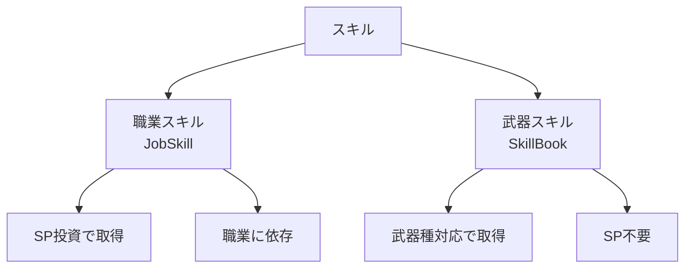
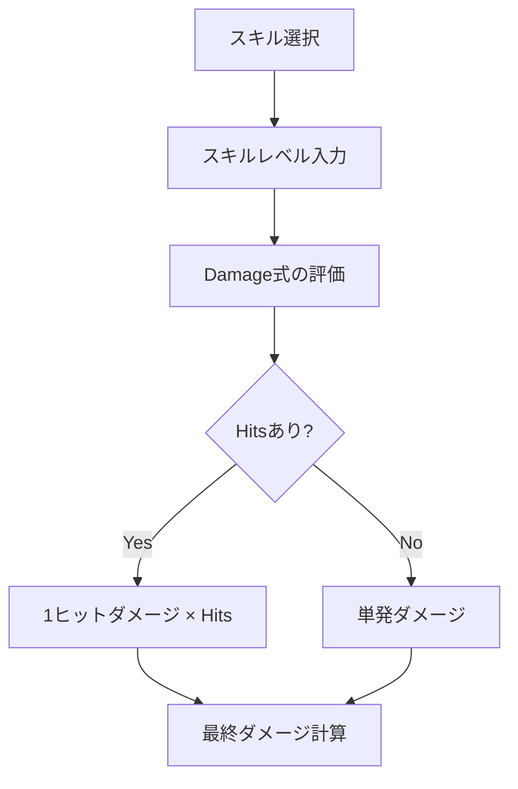

# 06_スキルシステム

**バージョン**: 1.0
**最終更新日**: 2025-11-22

## 1. スキルの種類



## 2. 職業スキル（JobSkill）

### 2.1 職業スキルとは

職業固有のスキルで、SPツリーへの投資により解法（アンロック）される。

### 2.2 取得条件

#### 2.2.1 SP投資による解法

職業CSVの「解法スキル名」列に記載されているスキルを取得するには:
- その段階の必要SPを満たす必要がある
- 系統内で上から順に取得する必要がある

**例**（ノービスのA-6）:
```csv
解法段階,必要SP,解法スキル名,...
A-6,25,応急手当,...
```

**取得条件**:
- A系統に累計25SP投資
- A-1〜A-5を先に取得済み

#### 2.2.2 職業依存

職業スキルは対応する職業でのみ使用可能。

**例**:
- Novice.Oukyuu_Teate（応急手当）→ ノービスのみ
- Wizard.Wind_2（ウィンド2）→ ウィザードのみ

### 2.3 職業スキルの定義

SkillCalc.yaml の SkillDefinition.JobSkill に定義されている。

#### 2.3.1 攻撃スキルの例

```yaml
Nagihara_i:
  MP: 5
  CT: 5
  Damage: "BaseDamage.Sword × 1.3"
```

**項目**:
- `MP`: 消費MP
- `CT`: クールタイム（秒）
- `Damage`: ダメージ計算式

#### 2.3.2 回復スキルの例

```yaml
Oukyuu_Teate:
  MP: 6
  CT: 7
  Heal: "UserMaxHP × 0.3"
```

**項目**:
- `Heal`: 回復量計算式

#### 2.3.3 バフスキルの例

```yaml
Sentou_Taisei:
  Buff:
    HP: "UserHP × 0.05"
    Power: "UserPower × 0.05"
    Magic: "UserMagic × 0.05"
```

**項目**:
- `Buff`: バフ効果の定義
  - 各ステータスに対する増加量

#### 2.3.4 持続時間付きバフの例

```yaml
Teppeki_no_Kokoro:
  MP: 30
  Duration: 30
  CT: 44
  Buff:
    HP: "UserHP × 0.15"
```

**項目**:
- `Duration`: 持続時間（秒）

### 2.4 多段ヒットスキル

```yaml
Retsujin_Enzangeki:
  MP: 12
  CT: 9
  Hits: 5
  Damage: "BaseDamage.Sword × 0.4"
```

**総ダメージ**:
```
TotalDamage = (BaseDamage.Sword × 0.4) × 5
```

#### 2.4.1 ヒット数範囲指定

```yaml
Tokoyami_Zangeki:
  MP: 24
  CT: 10
  Hits: "5~6"
  Damage: "BaseDamage.Sword × 0.6"
```

**計算オプション**:
- 最小: 5ヒット → TotalDamage = Damage × 5
- 最大: 6ヒット → TotalDamage = Damage × 6
- 平均: 5.5ヒット → TotalDamage = Damage × 5.5

### 2.5 武器種別依存のスキル

```yaml
Bunmawashi:
  MP: 6
  CT: 7
  Damage: "BaseDamage.Bow × 1.4"
```

**注意**:
- `BaseDamage.Bow`を参照するため、弓を装備していないと計算不可
- UI上で武器種が一致しない場合はスキルを選択不可にする

## 3. 武器スキル（SkillBook）

### 3.1 武器スキルとは

武器種別に対応したスキルで、SP投資に依らず選択可能。

### 3.2 取得条件

#### 3.2.1 武器種対応

武器スキルは対応する武器種を装備している場合のみ使用可能。

**例**:
- Sword.Zan_gekiha → 剣を装備している場合のみ
- Wand.Fairy_Swift → 杖を装備している場合のみ

#### 3.2.2 武器種対応CSV（今後作成予定）

武器種とスキルの対応関係を定義する別途CSVを作成予定。

**構造**:
| スキル名 | 対応武器種1 | 対応武器種2 | 対応武器種3 | ... |
|:---|:---|:---|:---|:---|
| Zan_gekiha | 剣 | - | - | - |
| Kaen_zan | 剣 | 大剣 | - | - |
| Fairy_Swift | 杖 | - | - | - |
| Blood_Shot | 弓 | - | - | - |

**仕様**:
- 1つのスキルが**複数の武器種**に対応可能
- 対応武器種の列は可変（必要に応じて追加）
- 未使用の列は「-」または空欄

**データ形式の代替案**:
カンマ区切りで複数武器種を記載する形式も検討可能:
| スキル名 | 対応武器種 |
|:---|:---|
| Kaen_zan | 剣,大剣 |

**実装時の注意**:
- このCSVは今後作成されるため、現時点では未存在
- 実装時にデータ構造を確定する

### 3.3 武器スキルの定義

SkillCalc.yaml の SkillDefinition.SkillBook に定義されている。

#### 3.3.1 レベル依存のスキル

```yaml
Zan_gekiha:
  MP: "15 + <Level> × 5"
  CT: "7 - <Level> × 0.25"
  Damage: null
```

**計算**（レベル10の場合）:
```
MP: 15 + 10 × 5 = 65
CT: 7 - 10 × 0.25 = 4.5
```

**注意**: `Damage: null`の場合、ダメージ計算式が未定義

#### 3.3.2 特殊効果を持つスキル

```yaml
Blood_Shot:
  MP: "28 + <Level> × 2"
  CT: "14 - <Level> × 0.5"
  Damage: null
  Extra:
    BleedDamage: "UserHP × (1.025 + <Level> × 0.1)"
```

**Extra効果**:
- 通常ダメージとは別に追加ダメージを与える
- 計算式は独立して定義される

#### 3.3.3 複合計算式のスキル

```yaml
Renge_Ha:
  MP: null
  Damage: "BaseDamage.Dagger × (<Level> + 13) × 0.05 + UserAgility × <AgilityFactor>"
```

**変数**:
- `<Level>`: スキルレベル（1〜10）
- `<AgilityFactor>`: 未定義パラメータは実際のステータス名に置き換え
  - `<AgilityFactor>` → `Agility`（素早さ）

**修正後の解釈**:
```yaml
Renge_Ha:
  Damage: "BaseDamage.Dagger × (<Level> + 13) × 0.05 + UserAgility × Agility"
```

**計算**（レベル5、UserAgility=100の場合）:
```
Damage = BaseDamage.Dagger × (5 + 13) × 0.05 + 100 × 100
       = BaseDamage.Dagger × 0.9 + 10000
```

**注意**: この解釈により、素早さステータスが二重に参照される形になります

## 4. スキルレベル

### 4.1 レベル範囲

**範囲**: 1〜10

### 4.2 レベルによる変化

#### 4.2.1 MP消費

```yaml
MP: "15 + <Level> × 5"
```

| レベル | MP |
|:---:|---:|
| 1 | 20 |
| 5 | 40 |
| 10 | 65 |

#### 4.2.2 クールタイム

```yaml
CT: "7 - <Level> × 0.25"
```

| レベル | CT |
|:---:|---:|
| 1 | 6.75秒 |
| 5 | 5.75秒 |
| 10 | 4.5秒 |

#### 4.2.3 ダメージ倍率

```yaml
Damage: "BaseDamage.GreatSword × (<Level> + 2) × 0.1"
```

| レベル | 倍率 |
|:---:|---:|
| 1 | 0.3 |
| 5 | 0.7 |
| 10 | 1.2 |

### 4.3 UI仕様

```
┌─────────────────────────────────────┐
│ スキル選択                          │
│ ┌────────────────┐                  │
│ │ 斬撃波         │ ▼               │
│ └────────────────┘                  │
│                                     │
│ スキルレベル: [5] ⯇ ▬▬▬▬▬▬▬ ⯈ [10] │
│                                     │
│ MP: 40  CT: 5.75秒                  │
│ ダメージ: BaseDamage.Sword × 0.7    │
└─────────────────────────────────────┘
```

## 5. スキルMP計算

### 5.1 固定値

```yaml
Nagihara_i:
  MP: 5
```

**MP消費**: 5（固定）

### 5.2 レベル依存

```yaml
Fairy_Swift:
  MP: "18 + <Level>"
```

**計算**（レベル5の場合）:
```
MP = 18 + 5 = 23
```

### 5.3 MP不要

```yaml
Renge_Ha:
  MP: null
```

**MP消費**: 0（または未定義）

## 6. スキル選択のフィルタリング

### 6.1 職業による制限

```
現在の職業 ≠ スキルの職業 → 候補に表示しない
```

**例**:
- 現在の職業: ノービス
- Wizard.Wind_2 → 表示しない

### 6.2 SP投資による制限

```
解法スキル名のスキル && SP不足 → グレーアウト
```

**例**:
- A-6の解法スキル「応急手当」
- 必要SP: 25
- 現在のA系統SP: 20
- 結果: グレーアウト

### 6.3 武器種による制限

```
武器スキル && 現在の武器種 ≠ スキルの武器種 → 選択不可
```

**例**:
- 現在の武器: 杖
- Sword.Zan_gekiha → 選択不可

## 7. スキル情報の表示

### 7.1 基本情報

```
┌─────────────────────────────────────┐
│ スキル名: 斬撃波                    │
│ 種類: 武器スキル（剣）              │
│ MP: 40  CT: 5.75秒                  │
│ レベル: 5 / 10                      │
└─────────────────────────────────────┘
```

### 7.2 詳細情報

```
┌─────────────────────────────────────┐
│ ダメージ計算式:                     │
│ BaseDamage.Sword × (<Level> + 2) × 0.1│
│                                     │
│ レベル5の場合:                      │
│ BaseDamage.Sword × 0.7              │
└─────────────────────────────────────┘
```

### 7.3 バフスキルの表示

```
┌─────────────────────────────────────┐
│ スキル名: 戦闘態勢                  │
│ 種類: バフスキル                    │
│ 持続時間: なし（常時）              │
│                                     │
│ 効果:                               │
│ ├─ HP: +5%                          │
│ ├─ 力: +5%                          │
│ └─ 魔力: +5%                        │
└─────────────────────────────────────┘
```

## 8. バリデーション

### 8.1 スキル選択のバリデーション

| 項目 | 条件 | エラー処理 |
|:---|:---|:---|
| 職業一致 | 現在の職業 = スキルの職業 | 候補に表示しない |
| SP投資 | 解法条件を満たしている | グレーアウト |
| 武器種一致 | 現在の武器種 = スキルの武器種 | 選択不可 |

### 8.2 スキルレベルのバリデーション

| 項目 | 制約 |
|:---|:---|
| レベル範囲 | 1〜10 |

### 8.3 計算式のバリデーション

**未定義変数のチェック**:
- `<Level>`: 必須（1〜10）
- `<AgilityFactor>`等の未定義パラメータ: 実際のステータス名（`Agility`, `Magic`, `Power`等）に置き換え

## 9. 火力計算への統合

### 9.1 スキルダメージ計算フロー



### 9.2 BaseDamageの参照

スキルのDamage式で`BaseDamage.<Weapon>`を参照する場合:
- 現在の武器種に対応する基礎ダメージを使用
- 05_ダメージ計算.md の2節を参照

### 9.3 スキル倍率の適用

```
SkillDamage = BaseDamage × <スキル倍率>
```

**例**（Nagihara_i）:
```
SkillDamage = BaseDamage.Sword × 1.3
```

## 10. 実装時の注意点

### 10.1 計算式のパース

**YAML内の計算式文字列をパースする必要がある**:
- `<Level>`の置換
- 四則演算のサポート
- 関数のサポート（max, min, floor, round, lnなど）

### 10.2 エラーハンドリング

**計算式エラー**:
- 構文エラー → エラーメッセージ表示
- 未定義変数 → デフォルト値（0）またはエラー表示

### 10.3 拡張性

**新規スキルの追加**:
- SkillCalc.yamlに定義を追加するのみ
- システム側の変更は不要

## 11. 改訂履歴

| 版 | 日付 | 変更内容 | 担当者 |
|:---|:---|:---|:---|
| 1.1 | 2025-11-22 | Q3-3, Q4-2の回答を反映: 未定義パラメータの扱い、武器種対応CSV構造を追加 | Claude |
| 1.0 | 2025-11-22 | 初版作成 | Claude |
