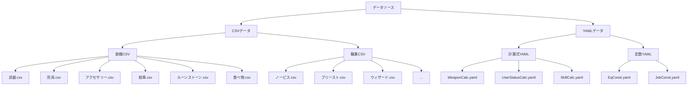
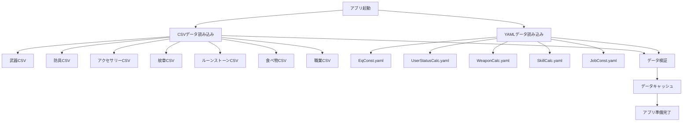

# 08_データ構造

**バージョン**: 1.0
**最終更新日**: 2025-11-22

## 1. データソースの概要



## 2. CSVデータ構造

### 2.1 武器CSV

**ファイル名**: `DA_EqCalc_Data - 武器.csv`

**文字エンコーディング**: UTF-8

**構造**:
| 列名 | 型 | 必須 | 説明 | 例 |
|:---|:---|:---:|:---|:---|
| アイテム名 | string | ○ | 武器の名称 | ウッドソード |
| 制作 | boolean | ○ | 制作可能かどうか | TRUE/FALSE |
| 武器種 | string | ○ | 剣/斧/杖/弓/大剣/短剣/槍/フライパン | 剣 |
| 使用可能Lv | number | ○ | 装備に必要なレベル | 32 |
| 攻撃力（初期値） | number | ○ | 基礎攻撃力 | 45 |
| 会心率（初期値） | number | ○ | 基礎会心率 | 8 |
| 会心ダメージ（初期値） | number | ○ | 基礎会心ダメージ | 13 |
| ダメージ補正（初期値） | number | ○ | 基礎ダメージ補正（%） | 90 |
| ct(初期値) | number | ○ | クールタイム（秒） | 1.2 |
| 最低ランク | string |   | 最低ランク（空白可） | A |
| 最高ランク | string |   | 最高ランク（空白可） | SSS |

**注意事項**:
- 最低ランク・最高ランクが空白の場合、SSS〜Fすべてのランクが利用可能
- 最低ランクが指定されている場合、CSVのデータは最低ランクの値を示す
- Fランクの値は逆算が必要

### 2.2 防具CSV

**ファイル名**: `DA_EqCalc_Data - 防具.csv`

**構造**:
| 列名 | 型 | 必須 | 説明 | 例 |
|:---|:---|:---:|:---|:---|
| アイテム名 | string | ○ | 防具の名称 | 鉄の兜 |
| 部位 | string | ○ | 頭/胴/脚 | 頭 |
| 防具種 | string | ○ | 軽/重/布/特殊 | 重 |
| 使用可能Lv | number | ○ | 装備に必要なレベル | 20 |
| 守備力（初期値） | number | ○ | 基礎守備力 | 50 |
| その他ステータス | number |   | 力/魔力/体力など | 10 |
| ランク | string | ○ | SSS〜F | A |

**注意事項**:
- その他ステータスは複数列にわたる可能性がある
- EX列が存在する場合、Equipment_EXの計算式を適用

### 2.3 アクセサリーCSV

**ファイル名**: `DA_EqCalc_Data - アクセサリー .csv`

**構造**:
| 列名 | 型 | 必須 | 説明 | 例 |
|:---|:---|:---:|:---|:---|
| アイテム名 | string | ○ | アクセサリーの名称 | 魔力のネックレス |
| 種類 | string | ○ | ネックレス/ブレスレット | ネックレス |
| 使用可能Lv | number | ○ | 装備に必要なレベル | 15 |
| ステータス（初期値） | number |   | 力/魔力/体力など | 20 |
| ランク | string | ○ | SSS〜F | S |

**注意事項**:
- アクセサリーには強化・叩きがない
- EX列が存在する場合、Equipment_EXの計算式を適用

### 2.4 紋章CSV

**ファイル名**: `DA_EqCalc_Data - 紋章.csv`

**構造**:
| 列名 | 型 | 必須 | 説明 | 例 |
|:---|:---|:---:|:---|:---|
| アイテム名 | string | ○ | 紋章の名称 | パワー紋章 |
| 力（%不要） | number |   | 力の%ボーナス | 10 |
| 魔力（%不要） | number |   | 魔力の%ボーナス | 5 |
| その他 | number |   | 他のステータスの%ボーナス | 3 |

**注意事項**:
- 列名が「%不要」となっているが、これらは%ボーナスとして扱う
- 例: 力（%不要）= 10 → 力に+10%のボーナス

### 2.5 ルーンストーンCSV

**ファイル名**: `DA_EqCalc_Data - ルーンストーン.csv`

**構造**:
| 列名 | 型 | 必須 | 説明 | 例 |
|:---|:---|:---:|:---|:---|
| アイテム名 | string | ○ | ルーンストーンの名称 | 水のルーン |
| グレード | string | ○ | ノーマル/グレート/バスター/レプリカ | ノーマル |
| ステータス | number |   | 力/魔力/体力など | 15 |
| 耐性1〜6 | string |   | 属性名, 値 | 水, 15 |

**注意事項**:
- 耐性列の形式: `属性名, 値`
- 値が存在するもののみ定義される
- グレードごとに1個まで装備可能

### 2.6 食べ物CSV

**ファイル名**: `DA_EqCalc_Data - 食べ物.csv`

**構造**:
| 列名 | 型 | 必須 | 説明 | 例 |
|:---|:---|:---:|:---|:---|
| アイテム名 | string | ○ | 食べ物の名称 | 焼き肉 |
| ステータス | number |   | 力/魔力/体力など | 10 |

**注意事項**:
- 固定値として加算される
- 1つのみ選択可能

### 2.7 職業CSV

**ファイル名**: `<職業名>.csv`（例: `ノービス.csv`）

**構造**:
| 列名 | 型 | 必須 | 説明 | 例 |
|:---|:---|:---:|:---|:---|
| 解法段階 | string | ○ | A-1/B-2/C-3または「初期値」「職業補正(%)」 | A-1 |
| 必要SP | number |   | その段階までの累計SP | 3 |
| 解法スキル名 | string |   | その段階で解法されるスキル名 | 応急手当 |
| 体力 | number |   | 体力のステータス値 | 10 |
| 力 | number |   | 力のステータス値 | 5 |
| 魔力 | number |   | 魔力のステータス値 | 0 |
| 精神 | number |   | 精神のステータス値 | 10 |
| 素早さ | number |   | 素早さのステータス値 | 0 |
| 器用さ | number |   | 器用さのステータス値 | 3 |
| 撃力 | number |   | 撃力（会心ダメージ）のステータス値 | 5 |
| 守備力 | number |   | 守備力のステータス値 | 0 |
| 耐性（複数列） | number |   | 各種耐性のステータス値 | 5 |

**特殊行**:
- **初期値**: レベル1時の基礎ステータス
- **職業補正(%)**: 職業固有の%補正

**注意事項**:
- 解法段階は系統（A/B/C）ごとに分かれる
- 必要SPは累計値
- 力/魔力/体力/精神はレベルごとに+1成長

## 3. YAMLデータ構造

### 3.1 EqConst.yaml（装備定数）

**ファイル名**: `EqConst.yaml`

**構造**:
```yaml
# 防具
Armor:
  Forge:
    Defence: 1
    Other: 2
  Reinforcement:
    MAX: 40
    Defence: 1
    Other: 2
  Rank:
    SSS: 8
    SS: 7
    ...
    F: 0

# アクセサリー
Accessory:
  Rank:
    SSS: 55
    SS: 50
    ...
    F: 0

# EX装備
Equipment_EX:
  Rank:
    CritR:
      SSS: 0.15
      ...
    Speed_CritD:
      SSS: 0.6
      ...
    Other:
      SSS: 0.7
      ...

# 武器
Weapon:
  Forge:
    Other: 1
  Reinforcement:
    Denominator: 320
    MAX: 80
    AttackP: 2
    CritD: 1
    CritR: 0
  Rank:
    SSS:
      Bonus:
        AttackP: 31
        CritD: 5
        CritR: 5
        CoolT: -0.1
      Alchemy:
        AttackP: 118
        CritD: 48
        CritR: 11
    ...
```

### 3.2 UserStatusCalc.yaml（ステータス計算式）

**ファイル名**: `UserStatusCalc.yaml`

**構造**:
```yaml
UserStatusFormula:
  BaseStatus: "(SumEquipment.<Stat> + Job.Initial.<Stat> * <JobLevel> + Job.SP.<Stat> + Food.<Stat> + UserOption.<Stat>) * (1 + Job.Bonus.<Stat>/100 + Emblem.Bonus.<Stat>/100)"

  RingOption:
    Enabled: "IfUserSetsThisTrue"
    IterativeApply: "repeat( round( CurrentStatus * (1 + Ring.<Stat>/100) ), until_converged )"

  Components:
    Equipment:
      Sum: "SumEquipment.<Stat>"
    Job:
      Initial: "Job.Initial.<Stat>"
      SP: "Job.SP.<Stat>"
      Bonus: "Job.Bonus.<Stat>"
    Food:
      Stat: "Food.<Stat>"
    UserOption:
      Stat: "UserOption.<Stat>"
    Emblem:
      Bonus: "Emblem.Bonus.<Stat>"
    Ring:
      Stat: "Ring.<Stat>"

EquipmentStatusFormula:
  Weapon:
    CritR: "Initial.CritR + Rank.Bonus.CritR + Rank.Alchemy.CritR + Reinforcement.CritR * <ReinforcementLevel> + Forge.CritR * <ForgeCritRAmount>"
    CritD: "Initial.CritD + Rank.Bonus.CritD + Rank.Alchemy.CritD + Reinforcement.CritD * <ReinforcementLevel> + Forge.CritD * <ForgeCritDAmount>"
    AttackP: "ROUNDUP( Initial.AttackP + AvailableLv * (Rank.Bonus.AttackP / Denominator) ) + Rank.Bonus.AttackP + Rank.Alchemy.AttackP + Reinforcement.AttackP * <ReinforcementLevel> + Forge.AttackP * <ForgeAttackPAmount>"
    DamageC: "Initial.DamageC + Rank.Bonus.DamageC"
    CoolT: "Initial.CoolT + Rank.Bonus.CoolT"

  Armor:
    MainStatus: "ROUND( (Initial.<Stat> + Forge.<Stat> * <ForgeCount>) * (1 + (Initial.<Stat> + Forge.<Stat> * <ForgeCount>)^0.2 * (Bonus.Rank / AvailableLv)) )"

  Jewel:
    MainStatus: "ROUNDUP( Initial.<Stat> + AvailableLv * Forge.<Stat> / 550 )"

  EX:
    RealValue: "ROUND( AvailableLv * Rank.<Stat> + 1 )"
```

### 3.3 WeaponCalc.yaml（武器ダメージ計算式）

**ファイル名**: `WeaponCalc.yaml`

**構造**:
```yaml
BasedDamage:
  Sword: "(WeaponAttackPower+UserPower*1.6)*DamageCorrection*(1+(WeaponCritDamage/100)+UserCritDamage*0.005)"
  Wand: "(WeaponAttackPower + UserMagic*1.75) * DamageCorrection * (1 + WeaponCritDamage/100 + UserCritDamage*0.0016)"
  ...

JobCorrection:
  Novice:
    Sword: "(UserPower*1.6 + WeaponAttackPower) * DamageCorrection * (1 + WeaponCritDamage/100 + UserCritDamage*0.005)"
    ...
  SpellRefactor:
    Bonus: "0.75 - round(0.475 * ln(max(UserPower, UserMagic) / min(UserPower, UserMagic)), 2) * 2"

FinalDamage: "(HitDamage-(EnemyDefence/2))*(1-(EnemyTypeResistance/100))*(1-(EnemyAttributeResistance/100))"
```

### 3.4 SkillCalc.yaml（スキル計算式）

**ファイル名**: `SkillCalc.yaml`

**構造**:
```yaml
SkillDefinition:
  # 武器固有スキル
  SkillBook:
    Sword:
      Zan_gekiha:
        MP: "15 + <Level>*5"
        CT: "7 - <Level>*0.25"
        Damage: null

    Dagger:
      Renge_Ha:
        MP: null
        Damage: "BaseDamage.Dagger * (<Level> + 13) * 0.05 + UserAgility * <AgilityFactor>"

  # 職業スキル
  JobSkill:
    Novice:
      Oukyuu_Teate:
        MP: 6
        CT: 7
        Heal: "UserMaxHP * 0.3"

      Sentou_Taisei:
        Buff:
          HP: "UserHP * 0.05"
          Power: "UserPower * 0.05"
          Magic: "UserMagic * 0.05"

    Fighter:
      Retsujin_Enzangeki:
        MP: 12
        CT: 9
        Hits: 5
        Damage: "BaseDamage.Sword * 0.4"
```

### 3.5 JobConst.yaml（職業定数）

**ファイル名**: `JobConst.yaml`

**構造**（現時点では明確な定義なし、将来的に必要）:
```yaml
JobDefinition:
  Novice:
    MaxLevel: 50
    AvailableWeapons: ["剣", "斧", "杖", "弓"]
    AvailableArmors: ["軽", "重", "布"]

  Wizard:
    MaxLevel: 80
    AvailableWeapons: ["杖"]
    AvailableArmors: ["布"]

  # ... 他の職業
```

## 4. データ読み込みフロー

### 4.1 初期化時の読み込み



### 4.2 データ検証

#### 4.2.1 CSVデータの検証
- 必須カラムの存在チェック
- データ型の検証
- 参照整合性チェック（装備名、スキル名など）

#### 4.2.2 YAMLデータの検証
- 構文エラーチェック
- 必須キーの存在チェック
- 計算式の妥当性チェック

### 4.3 エラーハンドリング

#### 4.3.1 読み込みエラー
- ファイルが存在しない → エラーメッセージ表示
- 構文エラー → 該当行を表示
- データ型エラー → 該当セルを表示

#### 4.3.2 フォールバック処理
- デフォルト値の使用
- 警告メッセージの表示
- 一部機能の無効化

## 5. データキャッシュ

### 5.1 キャッシュ対象
- CSVデータ（全装備・職業）
- YAMLデータ（全計算式・定数）

### 5.2 キャッシュ戦略
- 初回読み込み時にメモリにキャッシュ
- データ更新時（管理者ページからのアップロード）に再読み込み

### 5.3 キャッシュ無効化
- 手動リロード機能
- データ更新検出（ファイルの更新日時）

## 6. データ拡張性

### 6.1 新規データの追加

#### 6.1.1 新規装備
1. 対応するCSVに行を追加
2. アプリを再読み込み
3. 自動的に候補に追加される

#### 6.1.2 新規職業
1. 職業CSVを作成
2. JobConst.yamlに定義を追加
3. アプリを再読み込み

#### 6.1.3 新規スキル
1. SkillCalc.yamlに定義を追加
2. 武器スキルの場合、武器種対応CSVを更新
3. アプリを再読み込み

### 6.2 データ構造の変更

#### 6.2.1 新規ステータスの追加
- 影響範囲:
  - CSVカラムの追加
  - YAML計算式の更新
  - UI表示項目の追加
  - 計算ロジックの更新

#### 6.2.2 新規武器種の追加
- 影響範囲:
  - 武器CSVの「武器種」列に値を追加
  - WeaponCalc.yamlの BasedDamage に計算式を追加
  - JobConst.yamlの AvailableWeapons に追加

## 7. データ管理（管理者ページ）

### 7.1 CSVアップロード機能

**機能**:
- CSVファイルのアップロード
- データ検証
- データ反映

**UI**:
```
┌─────────────────────────────────────┐
│ CSVアップロード                     │
├─────────────────────────────────────┤
│ ファイル種別:                       │
│ ○ 武器 ○ 防具 ○ アクセサリー       │
│ ○ 紋章 ○ ルーン ○ 食べ物 ○ 職業   │
├─────────────────────────────────────┤
│ [ファイルを選択]                    │
│                                     │
│ [アップロード]                      │
└─────────────────────────────────────┘
```

### 7.2 YAMLアップロード機能

**機能**:
- YAMLファイルのアップロード
- 構文検証
- データ反映

### 7.3 データバックアップ

**機能**:
- 現在のデータをダウンロード
- ZIP形式でまとめてダウンロード

## 8. 改訂履歴

| 版 | 日付 | 変更内容 | 担当者 |
|:---|:---|:---|:---|
| 1.0 | 2025-11-22 | 初版作成 | Claude |
