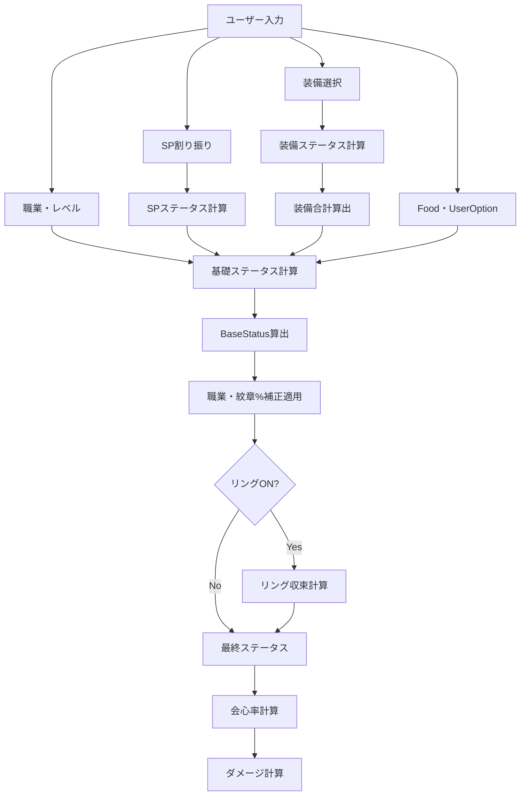
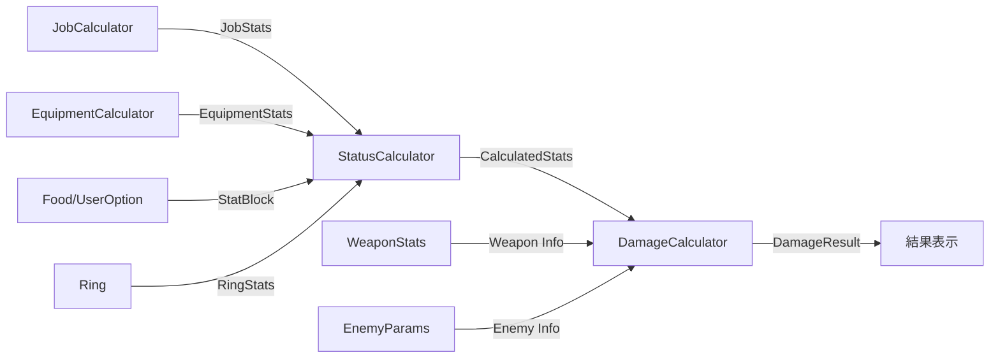

# 10_計算システム設計

**バージョン**: 1.0
**最終更新日**: 2025-11-22

## 1. 概要

本設計書は、仕様書「02_ステータスシステム」「03_装備システム」「04_職業SPシステム」「05_ダメージ計算」に基づいた計算システムの詳細設計を記述する。

### 1.1 設計方針

- **クリーンアーキテクチャ**: ビジネスロジックとフレームワークの分離
- **モジュール分離**: 責務ごとに独立したモジュールに分割
- **並列開発可能**: 各モジュールが独立してテスト・開発可能
- **型安全性**: TypeScriptの型システムを最大限活用
- **テスタビリティ**: 純粋関数を基本とし、副作用を最小化

### 1.2 設計における重要な原則

1. **計算の独立性**: 各計算モジュールは他のモジュールに依存しない
2. **データフローの明確化**: 入力→処理→出力を明確に定義
3. **エラーハンドリング**: 計算エラーは明示的に型で表現
4. **拡張性**: 新しい武器種・職業の追加が容易
5. **パフォーマンス**: 不要な再計算を避ける設計

## 2. ディレクトリ構造

```plaintext
src/
├── types/
│   └── calculator.ts           # 計算システムの型定義
├── lib/
│   └── calc/
│       ├── index.ts            # 公開API
│       ├── statusCalculator.ts # ステータス計算の統合
│       ├── equipmentCalculator.ts  # 装備計算
│       ├── jobCalculator.ts    # 職業・SP計算
│       ├── damageCalculator.ts # ダメージ計算
│       ├── weaponRankCalculator.ts # 武器ランク逆算
│       └── utils/
│           ├── mathUtils.ts    # 数学関数（ROUND, ROUNDUPなど）
│           └── validationUtils.ts  # バリデーション関数
└── __tests__/
    └── calc/
        ├── statusCalculator.test.ts
        ├── equipmentCalculator.test.ts
        ├── jobCalculator.test.ts
        ├── damageCalculator.test.ts
        └── weaponRankCalculator.test.ts
```

### 2.1 モジュール構成の意図

| モジュール | 責務 | 依存関係 |
|:---|:---|:---|
| calculator.ts (型定義) | 全計算モジュールの型定義 | なし |
| statusCalculator.ts | 最終ステータス計算の統合 | equipment, job, utils |
| equipmentCalculator.ts | 装備ステータス計算 | utils |
| jobCalculator.ts | 職業・SPステータス計算 | utils |
| damageCalculator.ts | ダメージ計算 | utils |
| weaponRankCalculator.ts | 武器ランク逆算 | utils |
| mathUtils.ts | 数学関数の提供 | なし |
| validationUtils.ts | バリデーションの提供 | なし |

## 3. 型定義設計

### 3.1 基本型定義 (src/types/calculator.ts)

```typescript
// ===== 共通型 =====

/**
 * ステータス種別
 */
export type StatType =
  | 'HP'
  | 'MP'
  | 'Power'        // 力
  | 'Magic'        // 魔力
  | 'Mind'         // 精神
  | 'Agility'      // 素早さ
  | 'Dex'          // 器用さ
  | 'Defense'      // 守備力
  | 'CritDamage';  // 撃力（会心ダメージ）

/**
 * ステータスブロック（各ステータスの値を保持）
 */
export type StatBlock = Partial<Record<StatType, number>>;

/**
 * 計算結果型（成功または失敗）
 */
export type CalcResult<T> =
  | { success: true; data: T }
  | { success: false; error: CalcError };

/**
 * 計算エラー
 */
export interface CalcError {
  code: string;
  message: string;
  context?: Record<string, unknown>;
}

// ===== 装備関連型 =====

/**
 * 武器ランク
 */
export type WeaponRank = 'SSS' | 'SS' | 'S' | 'A' | 'B' | 'C' | 'D' | 'E' | 'F';

/**
 * 武器種
 */
export type WeaponType =
  | '剣'
  | '斧'
  | '杖'
  | '弓'
  | '大剣'
  | '短剣'
  | '槍'
  | 'フライパン';

/**
 * 防具種
 */
export type ArmorType = '軽' | '重' | '布' | '特殊';

/**
 * 防具部位
 */
export type ArmorSlot = '頭' | '胴' | '脚';

/**
 * アクセサリー種類
 */
export type AccessoryType = 'ネックレス' | 'ブレスレット';

/**
 * ルーングレード
 */
export type RuneGrade = 'ノーマル' | 'グレート' | 'バスター' | 'レプリカ';

/**
 * 装備入力パラメータ
 */
export interface EquipmentInput {
  // 基礎データ
  itemName: string;
  availableLevel: number;

  // ランク関連
  rank: WeaponRank;
  minRank?: WeaponRank;  // 最低ランク（逆算用）

  // 強化・錬金・叩き
  reinforcement: number;  // 強化値
  alchemy: boolean;       // 錬金ON/OFF
  forge?: ForgeInput;     // 叩き設定

  // 初期値（CSVから取得）
  initial: StatBlock;
}

/**
 * 叩き入力パラメータ
 */
export interface ForgeInput {
  enabled: boolean;
  counts: Partial<Record<StatType | 'AttackP' | 'CritR' | 'CritD' | 'Defence', number>>;
}

/**
 * 装備ステータス計算結果
 */
export interface EquipmentStats {
  // 基礎値
  initial: StatBlock;

  // 各種加算値
  rankBonus: StatBlock;
  reinforcement: StatBlock;
  forge: StatBlock;
  alchemy: StatBlock;

  // 最終値
  final: StatBlock;

  // 武器固有
  attackPower?: number;
  critRate?: number;
  critDamage?: number;
  damageCorrection?: number;
  coolTime?: number;
}

/**
 * 装備セット
 */
export interface EquipmentSet {
  weapon?: EquipmentStats;
  head?: EquipmentStats;
  body?: EquipmentStats;
  leg?: EquipmentStats;
  necklace?: EquipmentStats;
  bracelet?: EquipmentStats;
  emblem?: EmblemStats;
  runes?: RuneStats[];
  ring?: RingStats;
}

/**
 * 紋章ステータス
 */
export interface EmblemStats {
  bonusPercent: StatBlock;  // %補正
}

/**
 * ルーンストーンステータス
 */
export interface RuneStats {
  grade: RuneGrade;
  stats: StatBlock;
  resistances: Partial<Record<string, number>>;  // 属性名 → 耐性値
}

/**
 * リングステータス
 */
export interface RingStats {
  bonusPercent: StatBlock;  // %補正（収束計算用）
}

// ===== 職業関連型 =====

/**
 * 職業名
 */
export type JobName = string;  // 'Novice' | 'Wizard' | ... など

/**
 * SP系統
 */
export type SPBranch = 'A' | 'B' | 'C';

/**
 * SP割り振り入力
 */
export interface SPAllocation {
  branch: SPBranch;
  tier: number;  // 1-based（A-1なら1, A-2なら2）
}

/**
 * 職業入力パラメータ
 */
export interface JobInput {
  jobName: JobName;
  level: number;
  spAllocations: SPAllocation[];
}

/**
 * 職業ステータス計算結果
 */
export interface JobStats {
  // 基礎値
  initial: StatBlock;  // 初期値 × レベル

  // SP由来
  sp: StatBlock;

  // 職業補正（%）
  bonusPercent: StatBlock;

  // 最終値（initial + sp）
  final: StatBlock;
}

// ===== 総合ステータス関連型 =====

/**
 * ステータス計算入力
 */
export interface StatusCalcInput {
  job: JobInput;
  equipment: EquipmentSet;
  food?: StatBlock;
  userOption?: StatBlock;
  ringEnabled: boolean;
}

/**
 * 計算済みステータス
 */
export interface CalculatedStats {
  // 各要素の内訳
  breakdown: {
    equipment: StatBlock;      // 装備合計
    jobInitial: StatBlock;     // 職業初期値 × レベル
    jobSP: StatBlock;          // SP由来
    food: StatBlock;           // 食べ物
    userOption: StatBlock;     // 高度設定
  };

  // 基礎ステータス（%補正前）
  base: StatBlock;

  // %補正
  bonusPercent: {
    job: StatBlock;
    emblem: StatBlock;
    total: StatBlock;
  };

  // リング収束（有効な場合）
  ring?: {
    iterations: number;
    delta: StatBlock;
  };

  // 最終ステータス
  final: StatBlock;

  // 会心率（特別計算）
  critRate: number;
}

// ===== ダメージ計算関連型 =====

/**
 * ダメージ計算入力
 */
export interface DamageCalcInput {
  // ユーザーステータス
  userStats: CalculatedStats;

  // 武器情報
  weaponType: WeaponType;
  weaponAttackPower: number;
  weaponCritRate: number;
  weaponCritDamage: number;
  damageCorrection: number;

  // 敵パラメータ
  enemy: EnemyParams;

  // オプション
  options: DamageCalcOptions;
}

/**
 * 敵パラメータ
 */
export interface EnemyParams {
  defense: number;
  typeResistance: number;    // 種族耐性（%）
  attributeResistance: number; // 属性耐性（%）
  hp?: number;  // 敵HP（TTK計算用）
}

/**
 * ダメージ計算オプション
 */
export interface DamageCalcOptions {
  critMode: 'always' | 'never' | 'expected';  // 会心モード
  damageCorrectionMode: 'min' | 'max' | 'avg'; // ダメージ補正モード
  skillLevel?: number;  // スキルレベル（1-10）
  skillName?: string;   // スキル名
}

/**
 * ダメージ計算結果
 */
export interface DamageResult {
  // 基礎ダメージ
  baseDamage: number;

  // 会心補正
  critMultiplier: number;

  // スキル倍率
  skillMultiplier: number;

  // ヒット数
  hits: number;

  // 1ヒットダメージ
  hitDamage: number;

  // 総ダメージ
  totalDamage: number;

  // 敵防御後のダメージ
  finalDamage: number;

  // その他指標
  dps?: number;  // DPS（クールタイムがある場合）
  ttk?: number;  // Time to Kill（敵HPがある場合）
  mpEfficiency?: number; // MP効率（スキルの場合）
}

// ===== 武器ランク逆算関連型 =====

/**
 * 武器ランク逆算入力
 */
export interface WeaponRankReverseInput {
  csvValue: number;       // CSVの値
  minRank: WeaponRank;    // 最低ランク
  statType: 'AttackP' | 'CritR' | 'CritD' | 'CoolT' | 'DamageC';
}

/**
 * 武器ランク逆算結果
 */
export interface WeaponRankReverseResult {
  fValue: number;  // F基準値
  allRanks: Record<WeaponRank, number>;  // 全ランクの値
}
```

### 3.2 型設計の意図

| 型 | 目的 | 重要な特徴 |
|:---|:---|:---|
| CalcResult<T> | エラーハンドリングの型安全性 | 成功/失敗を明示的に表現 |
| EquipmentStats | 装備計算の透明性 | 内訳を保持し、デバッグを容易にする |
| CalculatedStats | ステータス計算の透明性 | 全計算過程を追跡可能 |
| DamageResult | ダメージ計算の可視化 | 中間計算を含め、検証を容易にする |
| StatBlock | 汎用的なステータス保持 | Partial型で柔軟性を確保 |

## 4. 計算フロー設計

### 4.1 全体フロー



### 4.2 モジュール間データフロー



## 5. モジュール詳細設計

### 5.1 statusCalculator.ts

#### 5.1.1 責務

- 全ステータス計算の統合
- BaseStatusの算出
- 職業・紋章%補正の適用
- リング収束計算
- 会心率の計算

#### 5.1.2 公開インターフェース

```typescript
/**
 * ステータス計算のメイン関数
 */
export function calculateStatus(input: StatusCalcInput): CalcResult<CalculatedStats>;

/**
 * BaseStatusの算出
 */
export function calculateBaseStatus(
  equipment: StatBlock,
  jobInitial: StatBlock,
  jobSP: StatBlock,
  food: StatBlock,
  userOption: StatBlock
): StatBlock;

/**
 * %補正の適用
 */
export function applyPercentBonus(
  base: StatBlock,
  jobBonus: StatBlock,
  emblemBonus: StatBlock
): StatBlock;

/**
 * リング収束計算
 */
export function applyRingConvergence(
  base: StatBlock,
  ringBonus: StatBlock,
  maxIterations?: number
): { final: StatBlock; iterations: number; delta: StatBlock };

/**
 * 会心率の計算
 */
export function calculateCritRate(
  weaponCritRate: number,
  userDex: number
): number;
```

#### 5.1.3 内部ロジック

**BaseStatus計算**:
```typescript
// 仕様書 §2.7参照
BaseStatus = (SumEquipment + JobInitial×Level + JobSP + Food + UserOption)
             × (1 + JobBonus/100 + EmblemBonus/100)
```

**リング収束計算**:
```typescript
// 仕様書 §2.8参照
// 最大100回反復、変化がなくなるまで繰り返す
let current = base;
for (let i = 0; i < maxIterations; i++) {
  const next = round(current × (1 + ringBonus/100));
  if (isEqual(next, current)) break;
  current = next;
}
```

**会心率計算**:
```typescript
// 仕様書 §1.2.3参照
critRate = weaponCritRate + userDex × 0.3
```

### 5.2 equipmentCalculator.ts

#### 5.2.1 責務

- 各装備カテゴリのステータス計算
- 武器・防具・アクセサリーの計算式適用
- ランク・強化・叩き・錬金の処理
- 装備合計の算出

#### 5.2.2 公開インターフェース

```typescript
/**
 * 武器ステータス計算
 */
export function calculateWeaponStats(
  input: EquipmentInput,
  eqConst: EqConstData
): CalcResult<EquipmentStats>;

/**
 * 防具ステータス計算
 */
export function calculateArmorStats(
  input: EquipmentInput,
  eqConst: EqConstData,
  slot: ArmorSlot
): CalcResult<EquipmentStats>;

/**
 * アクセサリーステータス計算
 */
export function calculateAccessoryStats(
  input: EquipmentInput,
  eqConst: EqConstData
): CalcResult<EquipmentStats>;

/**
 * EX装備ステータス計算
 */
export function calculateEXStats(
  availableLevel: number,
  rank: WeaponRank,
  statType: 'CritR' | 'Speed_CritD' | 'Other',
  eqConst: EqConstData
): CalcResult<number>;

/**
 * 装備セット全体の合計算出
 */
export function sumEquipmentStats(equipment: EquipmentSet): StatBlock;
```

#### 5.2.3 内部ロジック

**武器計算** (仕様書 §2.2.1):
```typescript
// 会心率
CritR = Initial.CritR
        + Rank.Bonus.CritR
        + Rank.Alchemy.CritR (錬金ON時)
        + Reinforcement.CritR × ReinforcementLevel
        + Forge.CritR × ForgeCritRAmount

// 会心ダメージ
CritD = Initial.CritD
        + Rank.Bonus.CritD
        + Rank.Alchemy.CritD (錬金ON時)
        + Reinforcement.CritD × ReinforcementLevel
        + Forge.CritD × ForgeCritDAmount

// 攻撃力
AttackP = ROUNDUP(
            Initial.AttackP
            + AvailableLv × (Rank.Bonus.AttackP / 320)
          )
          + Rank.Bonus.AttackP
          + Rank.Alchemy.AttackP (錬金ON時)
          + Reinforcement.AttackP × ReinforcementLevel
          + Forge.AttackP × ForgeAttackPAmount
```

**防具計算** (仕様書 §2.2.2):
```typescript
// メインステータス
MainStatus = ROUND(
  (Initial.Stat + Forge.Stat × ForgeCount)
  × (1 + (Initial.Stat + Forge.Stat × ForgeCount)^0.2 × (Bonus.Rank / AvailableLv))
)

// 強化
Defence = Initial.Defence + Reinforcement.Defence × ReinforcementLevel
Other = Initial.Other + Reinforcement.Other × ReinforcementLevel
```

**アクセサリー計算** (仕様書 §2.2.3):
```typescript
MainStatus = ROUNDUP(
  Initial.Stat + AvailableLv × Rank.Stat / 550
)
```

**EX装備計算** (仕様書 §2.2.4):
```typescript
RealValue = ROUND(AvailableLv × Rank.Stat + 1)
```

### 5.3 jobCalculator.ts

#### 5.3.1 責務

- 職業初期値の計算
- SPツリーのステータス計算
- 職業補正(%）の取得
- SPバリデーション

#### 5.3.2 公開インターフェース

```typescript
/**
 * 職業ステータス計算
 */
export function calculateJobStats(
  input: JobInput,
  jobData: JobSPData[],
  jobConst: JobConstData
): CalcResult<JobStats>;

/**
 * 職業初期値の計算
 */
export function calculateJobInitial(
  jobName: JobName,
  level: number,
  jobData: JobSPData[]
): StatBlock;

/**
 * SPツリーのステータス計算
 */
export function calculateSPStats(
  allocations: SPAllocation[],
  jobData: JobSPData[]
): CalcResult<StatBlock>;

/**
 * SP割り振りのバリデーション
 */
export function validateSPAllocation(
  allocations: SPAllocation[],
  level: number,
  jobData: JobSPData[]
): CalcResult<void>;

/**
 * 最大SP計算
 */
export function calculateMaxSP(level: number): number;
```

#### 5.3.3 内部ロジック

**初期値計算** (仕様書 §2.3.1):
```typescript
// 力、魔力、体力、精神はレベル倍
Job.Initial.Power = InitialValue.Power × Level
Job.Initial.Magic = InitialValue.Magic × Level
Job.Initial.HP = InitialValue.HP × Level
Job.Initial.Mind = InitialValue.Mind × Level

// その他は固定
Job.Initial.Agility = InitialValue.Agility
Job.Initial.Dex = InitialValue.Dex
// ... その他
```

**SP計算** (仕様書 §2.3.2):
```typescript
// SP獲得量
MaxSP = Level × 2

// SPツリー累積
// A系統、B系統、C系統を個別に集計
let spStats = {};
for (const allocation of allocations) {
  const spData = findSPData(allocation.branch, allocation.tier);
  mergeStats(spStats, spData.stats);
}
```

**バリデーション** (仕様書 §3.6):
```typescript
// SP超過チェック
totalSP = sum(allocations.map(a => a.spCost))
if (totalSP > level × 2) {
  return error("SP_EXCEEDED");
}

// 順序チェック
for (const allocation of allocations) {
  const prev = findPreviousTier(allocation);
  if (prev && !allocations.includes(prev)) {
    return error("SP_ORDER_VIOLATION");
  }
}
```

### 5.4 damageCalculator.ts

#### 5.4.1 責務

- 基礎ダメージ計算
- 職業補正の適用
- 会心ダメージ計算
- 最終ダメージ計算（敵防御・耐性）
- スキルダメージ計算

#### 5.4.2 公開インターフェース

```typescript
/**
 * ダメージ計算のメイン関数
 */
export function calculateDamage(
  input: DamageCalcInput,
  weaponCalc: WeaponCalcData,
  skillCalc?: SkillCalcData
): CalcResult<DamageResult>;

/**
 * 基礎ダメージ計算
 */
export function calculateBaseDamage(
  weaponType: WeaponType,
  userStats: CalculatedStats,
  weaponAttackPower: number,
  weaponCritRate: number,
  weaponCritDamage: number,
  damageCorrection: number,
  weaponCalc: WeaponCalcData
): number;

/**
 * 職業補正の適用
 */
export function applyJobCorrection(
  baseDamage: number,
  jobName: JobName,
  weaponType: WeaponType,
  weaponCalc: WeaponCalcData
): number;

/**
 * 会心ダメージ計算
 */
export function applyCritDamage(
  baseDamage: number,
  critRate: number,
  critMode: 'always' | 'never' | 'expected'
): { damage: number; multiplier: number };

/**
 * 最終ダメージ計算（敵防御・耐性適用）
 */
export function calculateFinalDamage(
  hitDamage: number,
  enemy: EnemyParams
): number;

/**
 * スキルダメージ計算
 */
export function calculateSkillDamage(
  baseDamage: number,
  skillName: string,
  skillLevel: number,
  userStats: CalculatedStats,
  skillCalc: SkillCalcData
): CalcResult<{ damage: number; hits: number; mp: number; ct: number }>;
```

#### 5.4.3 内部ロジック

**基礎ダメージ** (仕様書 §2.1):
```typescript
// 武器種別ごとの計算式
switch (weaponType) {
  case '剣':
    return (WeaponAttackPower + UserPower × 1.6)
           × DamageCorrection
           × (1 + (WeaponCritDamage/100) + UserCritDamage × 0.005);

  case '杖':
    return (WeaponAttackPower + UserMagic × 1.75)
           × DamageCorrection
           × (1 + WeaponCritDamage/100 + UserCritDamage × 0.0016);

  // ... その他の武器種
}
```

**会心ダメージ** (仕様書 §4.2):
```typescript
switch (critMode) {
  case 'always':
    // 会心100%
    return baseDamage × critDamageMultiplier;

  case 'never':
    // 会心0%
    return baseDamage;

  case 'expected':
    // 期待値
    return baseDamage × (1 + critRate × critDamageMultiplier);
}
```

**最終ダメージ** (仕様書 §5.1):
```typescript
FinalDamage = (HitDamage - (EnemyDefence / 2))
              × (1 - EnemyTypeResistance / 100)
              × (1 - EnemyAttributeResistance / 100)
```

**スキルダメージ** (仕様書 §7.3):
```typescript
// 式を評価（例: "BaseDamage.Sword × 1.3"）
const formula = skillCalc.SkillDefinition[skillName].Damage;
const evaluated = evaluateFormula(formula, {
  BaseDamage,
  Level: skillLevel,
  UserStats: userStats.final
});
```

### 5.5 weaponRankCalculator.ts

#### 5.5.1 責務

- 武器ランク逆算
- 最低ランク指定時のF基準値算出
- 全ランクの値を算出

#### 5.5.2 公開インターフェース

```typescript
/**
 * 武器ランク逆算
 */
export function reverseWeaponRank(
  input: WeaponRankReverseInput,
  eqConst: EqConstData
): CalcResult<WeaponRankReverseResult>;

/**
 * F基準値の算出
 */
export function calculateFValue(
  csvValue: number,
  minRank: WeaponRank,
  statType: string,
  eqConst: EqConstData
): number;

/**
 * 全ランクの値を算出
 */
export function calculateAllRankValues(
  fValue: number,
  statType: string,
  eqConst: EqConstData
): Record<WeaponRank, number>;
```

#### 5.5.3 内部ロジック (仕様書 §2.2.3)

```typescript
// 逆算式
F_value = CSV_value - Rank.Bonus[minRank]

// 例: 攻撃力100、最低ランクA
// Rank.Bonus.AttackP (A): 25
// F_value = 100 - 25 = 75

// 全ランクの値
for (const rank of RANKS) {
  allRanks[rank] = round(fValue + Rank.Bonus[rank]);
}
```

### 5.6 utils/mathUtils.ts

#### 5.6.1 責務

- 数学関数の提供
- 仕様書に基づいた丸め処理

#### 5.6.2 公開インターフェース

```typescript
/**
 * 四捨五入
 */
export function round(value: number, decimals?: number): number;

/**
 * 切り上げ
 */
export function roundUp(value: number, decimals?: number): number;

/**
 * 切り捨て
 */
export function roundDown(value: number, decimals?: number): number;

/**
 * StatBlockの加算
 */
export function addStats(a: StatBlock, b: StatBlock): StatBlock;

/**
 * StatBlockの乗算
 */
export function multiplyStats(stats: StatBlock, multiplier: number): StatBlock;

/**
 * StatBlockの比較
 */
export function isEqualStats(a: StatBlock, b: StatBlock, epsilon?: number): boolean;
```

### 5.7 utils/validationUtils.ts

#### 5.7.1 責務

- 入力値のバリデーション
- エラーメッセージの生成

#### 5.7.2 公開インターフェース

```typescript
/**
 * レベル範囲チェック
 */
export function validateLevel(level: number, maxLevel: number): CalcResult<void>;

/**
 * 強化値範囲チェック
 */
export function validateReinforcement(
  reinforcement: number,
  equipmentType: 'weapon' | 'armor'
): CalcResult<void>;

/**
 * SP範囲チェック
 */
export function validateSP(totalSP: number, maxSP: number): CalcResult<void>;

/**
 * ランク妥当性チェック
 */
export function validateRank(
  rank: WeaponRank,
  minRank?: WeaponRank,
  maxRank?: WeaponRank
): CalcResult<void>;

/**
 * ルーングレード重複チェック
 */
export function validateRuneGrades(grades: RuneGrade[]): CalcResult<void>;
```

## 6. エラーハンドリング設計

### 6.1 エラーコード定義

```typescript
export enum CalcErrorCode {
  // 入力エラー
  INVALID_LEVEL = 'INVALID_LEVEL',
  INVALID_REINFORCEMENT = 'INVALID_REINFORCEMENT',
  INVALID_RANK = 'INVALID_RANK',

  // SP関連エラー
  SP_EXCEEDED = 'SP_EXCEEDED',
  SP_ORDER_VIOLATION = 'SP_ORDER_VIOLATION',

  // 装備エラー
  EQUIPMENT_LEVEL_INSUFFICIENT = 'EQUIPMENT_LEVEL_INSUFFICIENT',
  RUNE_GRADE_DUPLICATE = 'RUNE_GRADE_DUPLICATE',

  // データエラー
  DATA_NOT_FOUND = 'DATA_NOT_FOUND',
  FORMULA_EVALUATION_ERROR = 'FORMULA_EVALUATION_ERROR',

  // その他
  UNKNOWN_ERROR = 'UNKNOWN_ERROR',
}
```

### 6.2 エラーハンドリング方針

1. **CalcResult型の使用**: すべての計算関数はCalcResult型を返す
2. **早期リターン**: エラー時は即座にエラーを返す
3. **コンテキスト保持**: エラーに関連情報を含める
4. **型安全性**: TypeScriptの型システムで保証

### 6.3 エラーメッセージ例

```typescript
{
  code: 'SP_EXCEEDED',
  message: 'SPが上限を超えています',
  context: {
    totalSP: 120,
    maxSP: 100,
    level: 50
  }
}
```

## 7. パフォーマンス最適化設計

### 7.1 最適化方針

1. **メモ化**: 同じ入力に対する計算結果をキャッシュ
2. **遅延評価**: 必要になるまで計算を遅延
3. **増分計算**: 変更部分のみ再計算
4. **並列化**: 独立した計算は並列実行

### 7.2 メモ化対象

```typescript
/**
 * メモ化された装備ステータス計算
 */
export const memoizedCalculateWeaponStats = memoize(calculateWeaponStats);

/**
 * メモ化された職業ステータス計算
 */
export const memoizedCalculateJobStats = memoize(calculateJobStats);
```

### 7.3 増分計算の設計

```typescript
/**
 * 前回の計算結果を保持し、変更部分のみ再計算
 */
export class IncrementalStatusCalculator {
  private lastInput?: StatusCalcInput;
  private lastResult?: CalculatedStats;

  calculate(input: StatusCalcInput): CalcResult<CalculatedStats> {
    // 変更検知
    const changes = this.detectChanges(this.lastInput, input);

    if (changes.none) {
      // 変更なし → 前回結果を返す
      return { success: true, data: this.lastResult! };
    }

    if (changes.onlyEquipment) {
      // 装備のみ変更 → 装備計算のみ再実行
      // ...
    }

    // 全体再計算
    const result = calculateStatus(input);
    this.lastInput = input;
    this.lastResult = result.success ? result.data : this.lastResult;
    return result;
  }
}
```

## 8. テスト戦略

### 8.1 テストレベル

| レベル | 対象 | 目的 |
|:---|:---|:---|
| ユニットテスト | 各計算関数 | ロジックの正確性 |
| 統合テスト | モジュール間連携 | データフローの正確性 |
| E2Eテスト | 全体フロー | 実際のユースケース |
| スナップショットテスト | 計算結果 | リグレッション防止 |

### 8.2 テストケース設計

#### 8.2.1 equipmentCalculator.test.ts

```typescript
describe('equipmentCalculator', () => {
  describe('calculateWeaponStats', () => {
    it('基礎値のみの場合、正しく計算される', () => {
      // 仕様書の例を基にしたテスト
    });

    it('ランクボーナスが正しく適用される', () => {
      // SSS, SS, S, ... 各ランクでテスト
    });

    it('強化値が正しく加算される', () => {
      // 0, 40, 80でテスト
    });

    it('錬金ON時、錬金値が加算される', () => {
      // 錬金ON/OFFでテスト
    });

    it('叩きが正しく加算される', () => {
      // 各ステータスの叩きをテスト
    });

    it('最低ランク指定時、F値が正しく逆算される', () => {
      // 仕様書の具体例でテスト
    });
  });

  // ... 他のテストケース
});
```

#### 8.2.2 statusCalculator.test.ts

```typescript
describe('statusCalculator', () => {
  describe('calculateStatus', () => {
    it('装備+職業+SPの合計が正しく計算される', () => {});

    it('%補正が正しく適用される', () => {});

    it('リング収束が正しく動作する', () => {
      // 収束するケース
      // 収束しないケース（最大反復）
    });

    it('会心率が正しく計算される', () => {
      // 器用さ × 0.3 の検証
    });
  });
});
```

#### 8.2.3 damageCalculator.test.ts

```typescript
describe('damageCalculator', () => {
  describe('calculateBaseDamage', () => {
    it('剣の基礎ダメージが正しく計算される', () => {
      // 仕様書 §2.1.1の式を検証
    });

    it('杖の基礎ダメージが正しく計算される', () => {
      // 仕様書 §2.1.2の式を検証
    });

    // ... 各武器種
  });

  describe('applyJobCorrection', () => {
    it('ノービスの職業補正が正しく適用される', () => {
      // 仕様書 §3.2の式を検証
    });
  });

  describe('calculateFinalDamage', () => {
    it('敵防御・耐性が正しく適用される', () => {
      // 仕様書 §5の具体例を検証
    });
  });
});
```

### 8.3 テストデータ

```typescript
// test/fixtures/testData.ts

export const testWeaponData = {
  basic: {
    itemName: 'ウッドソード',
    availableLevel: 1,
    rank: 'F' as WeaponRank,
    reinforcement: 0,
    alchemy: false,
    initial: {
      AttackP: 10,
      CritR: 5,
      CritD: 50,
      DamageC: 80,
      CoolT: 1.5
    }
  },

  highRank: {
    itemName: 'レジェンドソード',
    availableLevel: 50,
    rank: 'SSS' as WeaponRank,
    minRank: 'A' as WeaponRank,
    reinforcement: 80,
    alchemy: true,
    initial: {
      AttackP: 100,
      CritR: 10,
      CritD: 60,
      DamageC: 90,
      CoolT: 1.2
    }
  }
};

export const testJobData = {
  novice: {
    jobName: 'Novice',
    level: 20,
    spAllocations: [
      { branch: 'A', tier: 1 },
      { branch: 'A', tier: 2 },
      { branch: 'B', tier: 1 }
    ]
  }
};
```

## 9. 実装優先順位

### 9.1 フェーズ1: 基盤整備

1. **型定義の整備** (calculator.ts)
   - 全ての型を定義
   - 既存型との統合

2. **ユーティリティ関数** (mathUtils.ts, validationUtils.ts)
   - 数学関数の実装
   - バリデーション関数の実装

3. **テスト基盤**
   - テストデータの準備
   - テストユーティリティの作成

### 9.2 フェーズ2: 計算モジュール実装

4. **equipmentCalculator.ts**
   - 武器計算
   - 防具計算
   - アクセサリー計算
   - EX装備計算

5. **jobCalculator.ts**
   - 職業初期値計算
   - SP計算
   - バリデーション

6. **weaponRankCalculator.ts**
   - ランク逆算

### 9.3 フェーズ3: 統合

7. **statusCalculator.ts**
   - BaseStatus計算
   - %補正適用
   - リング収束
   - 会心率計算

8. **damageCalculator.ts**
   - 基礎ダメージ
   - 職業補正
   - 会心ダメージ
   - 最終ダメージ
   - スキルダメージ

### 9.4 フェーズ4: 最適化とドキュメント

9. **パフォーマンス最適化**
   - メモ化の実装
   - 増分計算の実装

10. **ドキュメント整備**
    - API仕様書
    - サンプルコード
    - トラブルシューティング

## 10. 並列開発のためのインターフェース定義

### 10.1 モジュール間契約

各モジュールは、公開インターフェースのみに依存し、内部実装に依存しない。

```typescript
// ❌ 悪い例: 内部実装に依存
import { internalCalculateBase } from './statusCalculator';

// ✅ 良い例: 公開インターフェースのみ使用
import { calculateStatus } from './statusCalculator';
```

### 10.2 モックの提供

各モジュールは、テスト用のモックを提供する。

```typescript
// equipmentCalculator.mock.ts
export const mockCalculateWeaponStats = jest.fn().mockReturnValue({
  success: true,
  data: {
    initial: { AttackP: 100 },
    rankBonus: { AttackP: 25 },
    reinforcement: { AttackP: 80 },
    forge: {},
    alchemy: {},
    final: { AttackP: 205 }
  }
});
```

### 10.3 開発チーム分担例

| チーム | 担当モジュール | 依存関係 |
|:---|:---|:---|
| チームA | equipmentCalculator | utils のみ |
| チームB | jobCalculator | utils のみ |
| チームC | damageCalculator | utils のみ |
| チームD | statusCalculator | A, B, utils |
| チームE | weaponRankCalculator | utils のみ |

## 11. 移行戦略

### 11.1 既存コードとの共存

新しい計算システムは、既存システムと共存させる。

```typescript
// 既存システム
import { oldCalculateStatus } from './lib/calc/userStatus';

// 新システム
import { calculateStatus } from './lib/calc/statusCalculator';

// フラグで切り替え
const USE_NEW_CALCULATOR = process.env.USE_NEW_CALCULATOR === 'true';

export function getUserStatus(input) {
  if (USE_NEW_CALCULATOR) {
    return calculateStatus(input);
  } else {
    return oldCalculateStatus(input);
  }
}
```

### 11.2 段階的移行

1. **Phase 1**: 新システムを実装（既存システムと並行）
2. **Phase 2**: A/Bテストで検証
3. **Phase 3**: 徐々に新システムに切り替え
4. **Phase 4**: 既存システムを削除

### 11.3 互換性チェック

```typescript
// 互換性テスト
describe('compatibility', () => {
  it('新旧システムの計算結果が一致する', () => {
    const input = testInput;
    const oldResult = oldCalculateStatus(input);
    const newResult = calculateStatus(input);

    expect(newResult.final).toEqual(oldResult.final);
  });
});
```

## 12. 今後の拡張性

### 12.1 新武器種の追加

```typescript
// WeaponCalc.yamlに追加
BasedDamage:
  NewWeapon: "(WeaponAttackPower + UserPower × 2.0) × DamageCorrection"

// 型定義に追加
export type WeaponType =
  | '剣' | '斧' | '杖' | '弓' | '大剣' | '短剣' | '槍' | 'フライパン'
  | 'NewWeapon';  // 追加

// damageCalculator.tsに追加
case 'NewWeapon':
  return evaluateFormula(weaponCalc.BasedDamage.NewWeapon, context);
```

### 12.2 新ステータスの追加

```typescript
// StatTypeに追加
export type StatType =
  | 'HP' | 'MP' | 'Power' | 'Magic' | 'Mind' | 'Agility' | 'Dex' | 'Defense' | 'CritDamage'
  | 'NewStat';  // 追加

// 計算式に追加（必要に応じて）
```

### 12.3 新計算式の追加

```typescript
// プラグイン機構
export interface CalcPlugin {
  name: string;
  calculate: (input: any) => CalcResult<any>;
}

const plugins: CalcPlugin[] = [];

export function registerPlugin(plugin: CalcPlugin) {
  plugins.push(plugin);
}

export function calculateWithPlugins(input: any) {
  for (const plugin of plugins) {
    const result = plugin.calculate(input);
    if (result.success) {
      input = result.data;
    }
  }
  return input;
}
```

## 13. フィードバック・改善提案

### 13.1 仕様書への質問・懸念点

1. **リング収束計算の収束条件**
   - 仕様書では「変化がなくなるまで」とあるが、浮動小数点誤差をどう扱うか？
   - 提案: epsilon (1e-6) を使った比較

2. **職業補正の適用順序**
   - 紋章補正と職業補正の合算タイミングは明確だが、リング収束との関係は？
   - 確認: リング収束は%補正の「後」で正しいか？

3. **スキルの未定義パラメータ**
   - 仕様書 §7.3.3で`<AgilityFactor>`などは実際のステータス名に置き換えとあるが、
     これは`UserAgility`を参照するのか、それとも別の係数か？
   - 確認が必要

4. **EX装備の適用対象**
   - 仕様書 §2.2.4で「防具・アクセサリーのCSVにEX列が存在する場合」とあるが、
     具体的にどの装備にEX列があるのか？
   - データサンプルがあると実装しやすい

5. **武器ランク逆算の小数点処理**
   - 仕様書 §2.2.3で「小数点は四捨五入」とあるが、どの段階で丸めるか？
   - F値算出時か、各ランク値算出時か？

### 13.2 設計の改善提案

1. **計算式の外部化**
   - 現状YAMLに文字列で記述されている計算式を、JSONスキーマで検証可能な形式にする
   - 例: JSON Schema + カスタムバリデーター

2. **計算履歴の保存**
   - デバッグ・検証のため、計算過程を保存する機能
   - 例: `CalculatedStats`に`history`フィールドを追加

3. **パフォーマンスモニタリング**
   - 計算時間の測定・ログ出力
   - ボトルネック特定のため

4. **型レベルでの制約**
   - TypeScriptの型システムでより多くの制約を表現
   - 例: ランク範囲を型で制約（`type RankRange<Min, Max> = ...`）

## 14. まとめ

### 14.1 本設計書の要点

- **モジュール分離**: 責務ごとに独立したモジュール
- **型安全性**: CalcResult型によるエラーハンドリング
- **テスタビリティ**: 純粋関数を基本とした設計
- **並列開発可能**: 公開インターフェースのみに依存
- **拡張性**: 新要素の追加が容易

### 14.2 実装時の注意点

1. **仕様書との整合性**: 計算式は仕様書の記載通りに実装
2. **テストファースト**: テストを先に書いてから実装
3. **段階的実装**: フェーズに従って段階的に実装
4. **コードレビュー**: 計算ロジックは必ずレビューを受ける
5. **ドキュメント**: 複雑な計算は必ずコメントを記述

### 14.3 成功基準

- [ ] 全てのユニットテストが通る
- [ ] 仕様書の全ての計算式が実装されている
- [ ] 既存システムとの互換性が確認されている
- [ ] パフォーマンスが許容範囲内
- [ ] ドキュメントが整備されている

## 15. 改訂履歴

| 版 | 日付 | 変更内容 | 担当者 |
|:---|:---|:---|:---|
| 1.0 | 2025-11-22 | 初版作成 | Claude |

## 付録A: 参照仕様書

- 02_ステータスシステム.md
- 03_装備システム.md
- 04_職業SPシステム.md
- 05_ダメージ計算.md

## 付録B: 関連ドキュメント

- ProductDevelop.md (開発プロセス指針)
- 既存型定義 (src/types/calc.ts, src/types/data.ts)
