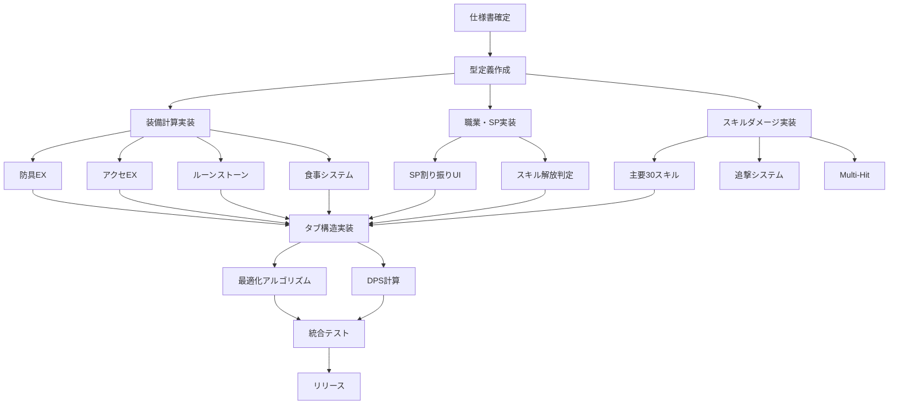

# 機能実装ロードマップ (Feature Roadmap)
**最終更新日**: 2025-11-24  
**バージョン**: v1.0  
**参照仕様書**: spec-equipment-calc.md, spec-skill-damage.md, spec-ui-flow.md

---

## 1. 実装済み機能サマリー

### 1.1 完成済み機能

| 機能カテゴリ | 機能名 | 完成度 |
|------------|--------|--------|
| **ページ** | トップページ (Hero のみ) | 60% |
| | ビルド編集画面 (基本構造) | 70% |
| | ダメージ計算画面 (基本構造) | 50% |
| | 最適装備探索画面 (枠のみ) | 30% |
| **計算ロジック** | 職業基礎ステータス計算 | 90% |
| | 武器ランク計算 | 80% |
| | 通常攻撃ダメージ (7武器種) | 80% |
| **UI コンポーネント** | 職業選択・レベル入力 | 85% |
| | SP割り振りスライダー | 75% |
| | 装備スロット選択 | 65% |
| | ステータス表示 | 85% |
| **データ管理** | CSV ローダー | 75% |
| | YAML ローダー | 67% |
| | Zustand ストア | 68% |

---

## 2. 未実装機能リスト (全体)

以下の機能が未実装または不完全です。各機能に優先度 (High/Medium/Low) と推定工数を設定します。

---

## 3. 装備計算関連の未実装機能

### 3.1 武器計算

| 機能 | 優先度 | 推定工数 | 依存関係 | 説明 |
|------|--------|---------|---------|------|
| **叩き回数の選択UI** | High | 6h | 装備スロットUI | ドロップ武器は叩き不可、通常武器は0-12回選択可 |
| **強化レベルの選択UI** | High | 4h | 装備スロットUI | 強化によるダメージ補正の変化 |
| **武器ランク選択UI** | High | 6h | 装備スロットUI | F〜SSS を選択可能に |
| **武器クオリティ (CT) の計算** | Medium | 4h | weaponCalculator | クールタイム計算 (将来のDPS計算で使用) |
| **武器固有能力の実装** | Medium | 16h | YAML設定 | ケルベロス武器・スタック管理等 |

**合計推定工数**: 36h

---

### 3.2 防具計算

| 機能 | 優先度 | 推定工数 | 依存関係 | 説明 |
|------|--------|---------|---------|------|
| **防具ランク選択UI** | High | 6h | 装備スロットUI | F〜SSS を選択可能に |
| **防具叩き回数選択UI** | High | 6h | 装備スロットUI | SS超えで叩き可能 (0-12回) |
| **防具ARMOR式の完全実装** | High | 8h | equipmentCalculator | 仕様書の式に基づく実装 |
| **防具EXステータス計算** | High | 10h | equipmentCalculator | 2種類のEXステータス付与 |
| **複数部位の同時装備** | High | 4h | buildStore | 頭・胴・足を同時装備 |
| **防具タイプ制限** | Medium | 4h | 職業データ | 職業ごとに布/革/金属を制限 |

**合計推定工数**: 38h

---

### 3.3 アクセサリ計算

| 機能 | 優先度 | 推定工数 | 依存関係 | 説明 |
|------|--------|---------|---------|------|
| **アクセサリランク選択UI** | High | 6h | 装備スロットUI | F〜SSS を選択可能に |
| **アクセサリメインステータス計算** | High | 8h | equipmentCalculator | 仕様書の式に基づく実装 |
| **アクセサリEXステータス計算** | High | 8h | equipmentCalculator | EX実数値の計算 |
| **ネックレス・ブレスレット同時装備** | High | 4h | buildStore | 2つのスロットを用意 |

**合計推定工数**: 26h

---

### 3.4 紋章システム

| 機能 | 優先度 | 推定工数 | 依存関係 | 説明 |
|------|--------|---------|---------|------|
| **紋章選択UI** | High | 6h | 装備スロットUI | 紋章CSVから選択 |
| **紋章ステータス加算** | High | 4h | equipmentCalculator | 単純加算 |
| **紋章詳細表示** | Medium | 4h | ToolTip | ホバーで詳細表示 |

**合計推定工数**: 14h

---

### 3.5 ルーンストーンシステム

| 機能 | 優先度 | 推定工数 | 依存関係 | 説明 |
|------|--------|---------|---------|------|
| **ルーンストーン選択UI (4枠)** | High | 10h | 装備スロットUI | Normal/Buster/Great/Replica 各1つまで |
| **グレード制限の実装** | High | 6h | バリデーション | 同グレードを複数選択不可 |
| **ルーンストーンステータス加算** | High | 6h | equipmentCalculator | 単純加算 |
| **ルーンストーン耐性計算** | Medium | 8h | 耐性システム | 耐性配列の管理 (将来拡張) |

**合計推定工数**: 30h

---

### 3.6 食事システム

| 機能 | 優先度 | 推定工数 | 依存関係 | 説明 |
|------|--------|---------|---------|------|
| **食事ON/OFFトグル** | High | 3h | Toggle UI | 食事を有効/無効に |
| **食事選択UI** | High | 4h | CustomSelect | 食べ物CSVから選択 |
| **食事ステータス加算** | High | 4h | equipmentCalculator | 単純加算 |
| **食事耐性計算** | Medium | 6h | 耐性システム | 耐性配列の管理 (将来拡張) |

**合計推定工数**: 17h

---

## 4. 職業・SP関連の未実装機能

### 4.1 職業選択・レベル管理

| 機能 | 優先度 | 推定工数 | 依存関係 | 説明 |
|------|--------|---------|---------|------|
| **職業固有%補正の実装** | High | 6h | jobCalculator | 最終ステータスに%補正を適用 |
| **使用可能武器種の自動制限** | High | 4h | 装備スロットUI | 職業選択時に武器種を制限 |
| **使用可能防具タイプの自動制限** | High | 4h | 装備スロットUI | 職業選択時に布/革/金属を制限 |

**合計推定工数**: 14h

---

### 4.2 SP割り振り

| 機能 | 優先度 | 推定工数 | 依存関係 | 説明 |
|------|--------|---------|---------|------|
| **SP割り振りタブの詳細UI** | High | 10h | Tab UI | A/B/Cライン別のスライダー |
| **解放済みスキル一覧表示** | High | 8h | jobCalculator | 解放段階に応じたスキル一覧 |
| **未解放スキルのグレーアウト表示** | Medium | 6h | スキル選択UI | 使用不可スキルの明示 |
| **SP超過時のエラー表示** | High | 4h | バリデーション | A+B+C <= 総SPのチェック |
| **SP割り振りのプリセット保存** | Low | 8h | Local Storage | よく使う構成を保存 |

**合計推定工数**: 36h

---

## 5. スキル・ダメージ計算関連の未実装機能

### 5.1 スキルダメージ計算

| 機能 | 優先度 | 推定工数 | 依存関係 | 説明 |
|------|--------|---------|---------|------|
| **主要30スキルの実装** | High | 24h | SkillCalc.yaml | ノービス/ファイター/ウィザード等 |
| **全100スキルの実装** | Medium | 40h | SkillCalc.yaml | 全職業の全スキル対応 |
| **武器種別フィルタリング** | High | 6h | スキル選択UI | 対応武器種のみ選択可能に |
| **スキル解放条件の判定** | High | 8h | jobCalculator | SP不足スキルは選択不可 |
| **スキル説明の表示** | Medium | 4h | ToolTip | ホバーでスキル詳細表示 |

**合計推定工数**: 82h

---

### 5.2 武器追撃システム

| 機能 | 優先度 | 推定工数 | 依存関係 | 説明 |
|------|--------|---------|---------|------|
| **剣改の追撃 (22%)** | High | 4h | damageCalculator | 元の攻撃 × 22% × 回数 |
| **ジェミニの追撃 (30%)** | High | 4h | damageCalculator | 元の攻撃 × 30% |
| **幻影大剣の追撃 (30%)** | High | 4h | damageCalculator | 元の攻撃 × 30% |
| **ゼクロ弓の追撃** | Medium | 6h | damageCalculator | 元の攻撃 × 22% × ( UserSpeed * 0.011 + 2 ) |
| **夏武器の追撃 (水耐性依存)** | Medium | 6h | 耐性システム | 追撃回数 = floor(水耐性 / 5) |
| **ベス剣の追撃 (4回)** | Medium | 4h | damageCalculator | 元の攻撃 × 10% × 4回 |
| **盗賊斧の追撃 (MP依存)** | Medium | 6h | damageCalculator | 現在MP × 0.2 × 回数 |
| **炎牙の追撃 (防御貫通)** | Medium | 6h | damageCalculator | 元の攻撃 × 5% × 回数 |
| **全22種類の追撃実装** | Low | 60h | YAML設定 | 全武器の追撃対応 |

**合計推定工数**: 100h

---

### 5.3 Hit数・マルチヒット対応

| 機能 | 優先度 | 推定工数 | 依存関係 | 説明 |
|------|--------|---------|---------|------|
| **Multi-Hit スキルの実装** | High | 10h | damageCalculator | Hit毎に丸め or 最後に丸め |
| **Hit数の動的計算** | Medium | 8h | SkillCalc.yaml | マリーナレーン2等 (素早さ依存) |
| **Hit毎のダメージ表示** | Medium | 6h | DamageResult UI | 1Hit当たり + 総ダメージ |

**合計推定工数**: 24h

---

## 6. UI/UX関連の未実装機能

### 6.1 タブ構造

| 機能 | 優先度 | 推定工数 | 依存関係 | 説明 |
|------|--------|---------|---------|------|
| **職業タブの実装** | High | 6h | Tab UI | 職業選択・レベル入力 |
| **SP割り振りタブの実装** | High | 10h | Tab UI | SP割り振り・スキル解放表示 |
| **装備タブの実装** | High | 12h | Tab UI | 全装備スロット表示 |
| **食事・指輪タブの実装** | High | 6h | Tab UI | 食事・指輪の設定 |
| **最終ステータスタブの実装** | High | 8h | Tab UI | ステータス内訳表示 |
| **スキル/通常攻撃タブの実装** | High | 8h | Tab UI | スキル選択・通常攻撃選択 |
| **結果タブの実装** | High | 10h | Tab UI | ダメージ結果・詳細表示 |

**合計推定工数**: 60h

---

### 6.2 バリデーション・エラー表示

| 機能 | 優先度 | 推定工数 | 依存関係 | 説明 |
|------|--------|---------|---------|------|
| **装備未選択時のエラー表示** | High | 4h | バリデーション | 武器未選択時に警告 |
| **SP超過時のエラー表示** | High | 4h | バリデーション | A+B+C > 総SP 時に警告 |
| **職業と武器種の不一致検出** | High | 4h | バリデーション | 使用不可武器選択時に警告 |
| **ランク・叩き回数の妥当性チェック** | Medium | 6h | バリデーション | SS超えで叩き可能等 |
| **リアルタイムバリデーション** | Medium | 8h | フォーム | 入力中にエラー表示 |

**合計推定工数**: 26h

---

### 6.3 ナビゲーション・永続化

| 機能 | 優先度 | 推定工数 | 依存関係 | 説明 |
|------|--------|---------|---------|------|
| **ヘッダーナビゲーション** | High | 6h | レイアウト | ロゴ・リンク常時表示 |
| **Local Storage による永続化** | Medium | 8h | buildStore | 装備構成・SP割り振りを保存 |
| **構成の保存・読み込み機能** | Medium | 10h | Local Storage | 複数構成を名前付きで保存 |
| **構成の共有機能 (URL)** | Low | 12h | URL パラメータ | URLで構成を共有 |

**合計推定工数**: 36h

---

### 6.4 詳細表示・ツールチップ

| 機能 | 優先度 | 推定工数 | 依存関係 | 説明 |
|------|--------|---------|---------|------|
| **ステータス内訳の表示** | High | 8h | Tooltip | ホバーで職業/装備別の内訳表示 |
| **スキル詳細の表示** | Medium | 6h | Tooltip | ホバーでスキル説明・CT・消費MP |
| **装備詳細の表示** | Medium | 6h | Tooltip | ホバーで装備の全ステータス表示 |
| **ダメージ計算式の表示** | Medium | 8h | 詳細パネル | 使用された式・要素を表示 |

**合計推定工数**: 28h

---

## 7. 最適装備探索関連の未実装機能

### 7.1 最適化アルゴリズム

| 機能 | 優先度 | 推定工数 | 依存関係 | 説明 |
|------|--------|---------|---------|------|
| **装備組み合わせ列挙** | High | 12h | optimize.ts | 全装備パターンの生成 |
| **枝刈り最適化 (DP)** | High | 16h | アルゴリズム | 動的計画法による高速化 |
| **並列計算 (Web Worker)** | Medium | 12h | Worker API | 計算を並列化 |
| **プログレスバー表示** | Medium | 6h | UI | 計算進捗を表示 |
| **キャンセル機能** | Medium | 4h | UI | 計算を中断可能に |
| **上位N件の結果表示** | High | 8h | UI | Top 5 等を表示 |

**合計推定工数**: 58h

---

### 7.2 条件入力パネル

| 機能 | 優先度 | 推定工数 | 依存関係 | 説明 |
|------|--------|---------|---------|------|
| **職業・レベル選択** | High | 4h | 条件入力UI | 最適化の基本条件 |
| **スキル選択** | High | 6h | 条件入力UI | 最適化対象のスキル |
| **武器種制限** | Medium | 4h | 条件入力UI | 複数選択可 |
| **防具タイプ制限** | Medium | 4h | 条件入力UI | 布/革/金属 |
| **食事・指輪の考慮フラグ** | Medium | 4h | 条件入力UI | ON/OFF |
| **SPライン条件 (min-max)** | Medium | 8h | 条件入力UI | A/B/C の範囲指定 |

**合計推定工数**: 30h

---

### 7.3 結果表示・引き継ぎ

| 機能 | 優先度 | 推定工数 | 依存関係 | 説明 |
|------|--------|---------|---------|------|
| **ベスト構成の表示** | High | 8h | 結果表示UI | 最大ダメージ・装備一覧 |
| **上位候補のリスト表示** | High | 6h | 結果表示UI | Top 5 等 |
| **火力検証モードで開くボタン** | High | 6h | ページ遷移 | 結果をビルド編集画面に引き継ぎ |
| **結果のエクスポート (JSON)** | Low | 6h | ファイル出力 | 結果をダウンロード |

**合計推定工数**: 26h

---

## 8. 高度機能・将来拡張

### 8.1 DPS計算

| 機能 | 優先度 | 推定工数 | 依存関係 | 説明 |
|------|--------|---------|---------|------|
| **DPS計算枠の実装** | Medium | 8h | damageCalculator | CT・追撃発生率の考慮 |
| **時間軸シミュレーション** | Low | 20h | アルゴリズム | スキル回しの最適化 |
| **バフ持続時間の管理** | Low | 12h | バフシステム | バフの開始・終了管理 |

**合計推定工数**: 40h

---

### 8.2 特殊武器能力

| 機能 | 優先度 | 推定工数 | 依存関係 | 説明 |
|------|--------|---------|---------|------|
| **ケルベロス武器 (スタック管理)** | Medium | 12h | YAML設定 | HP消費・スタック+1・バフ適用 |
| **身を焦がす焼焔の実装** | Medium | 10h | YAML設定 | 複雑な自己バフロジック |
| **全特殊武器能力の実装** | Low | 40h | YAML設定 | 全特殊武器対応 |

**合計推定工数**: 62h

---

### 8.3 耐性・敵ステータスシステム

| 機能 | 優先度 | 推定工数 | 依存関係 | 説明 |
|------|--------|---------|---------|------|
| **敵ステータス入力UI** | Medium | 6h | EnemyInput | 敵の防御・耐性を入力 |
| **属性耐性の計算** | Medium | 10h | 耐性システム | ダメージ軽減計算 |
| **敵別のプリセット** | Low | 8h | データ整備 | ボス敵のステータスを登録 |

**合計推定工数**: 24h

---

## 9. 全体工数サマリー

### 9.1 カテゴリ別工数

| カテゴリ | 合計工数 | 優先度High | 優先度Medium | 優先度Low |
|---------|---------|-----------|-------------|----------|
| **装備計算** | 161h | 98h | 48h | 15h |
| **職業・SP** | 50h | 24h | 18h | 8h |
| **スキル・ダメージ** | 206h | 76h | 70h | 60h |
| **UI/UX** | 150h | 92h | 50h | 8h |
| **最適化エンジン** | 114h | 52h | 50h | 12h |
| **高度機能** | 126h | 0h | 60h | 66h |
| **合計** | **807h** | 342h | 296h | 169h |

### 9.2 フェーズ別の推奨工数配分

| フェーズ | 対象機能 | 推定工数 | 期間 |
|---------|---------|---------|------|
| **Phase 1** | 装備計算・職業・基本スキル | 220h | 3週間 |
| **Phase 2** | UI/UX・タブ構造・デザイン | 150h | 2週間 |
| **Phase 3** | 最適化エンジン・追撃システム | 180h | 2週間 |
| **Phase 4** | 高度機能・DPS・特殊武器 | 120h | 2週間 |
| **仕上げ** | バグ修正・パフォーマンス最適化 | 60h | 1週間 |
| **合計** | - | **730h** | **10週間** |

※ バッファ 10% を含む

---

## 10. 依存関係図 (Mermaid)

---

## 11. 実装優先順位 (推奨順序)

### Phase 1: 基盤機能 (Week 1-3)

1. **防具EXステータス計算** (High, 10h)
2. **アクセサリEXステータス計算** (High, 8h)
3. **ルーンストーンシステム** (High, 30h)
4. **食事システム** (High, 17h)
5. **主要30スキルの実装** (High, 24h)
6. **SP割り振りタブ** (High, 10h)
7. **職業固有%補正** (High, 6h)

**合計**: 105h

---

### Phase 2: UI/UX完成 (Week 4-5)

1. **タブ構造の実装** (High, 60h)
2. **バリデーション・エラー表示** (High, 26h)
3. **ナビゲーション** (High, 6h)
4. **ステータス内訳表示** (High, 8h)
5. **デザインシステム適用** (High, 40h)

**合計**: 140h

---

### Phase 3: 最適化・高度機能 (Week 6-7)

1. **最適化アルゴリズム** (High, 52h)
2. **武器追撃システム (主要8種)** (High/Medium, 40h)
3. **Multi-Hit対応** (High, 10h)
4. **DPS計算枠** (Medium, 8h)

**合計**: 110h

---

### Phase 4: 仕上げ (Week 8-10)

1. **特殊武器能力** (Medium, 22h)
2. **全100スキル実装** (Medium, 40h)
3. **耐性システム** (Medium, 24h)
4. **パフォーマンス最適化** (High, 20h)
5. **バグ修正・QA** (High, 40h)

**合計**: 146h

---

## 12. リスクと対策

### 12.1 工数オーバーのリスク

| リスク | 対策 |
|--------|------|
| スキル実装が想定以上に複雑 | 主要30スキルに絞り、残りは Phase 4 へ |
| 最適化アルゴリズムが遅い | 枝刈り・並列化を徹底、Web Worker 活用 |
| YAML式評価が困難 | mathjs 等のライブラリ導入 |

### 12.2 仕様変更のリスク

| リスク | 対策 |
|--------|------|
| ゲーム側の仕様変更 | 仕様凍結期間を設定 (Phase 2 開始前) |
| ユーザからの追加要望 | Phase 4 で対応、または v1.1 へ延期 |

---

## 13. 成功基準

### 13.1 Phase 1 終了時

- [ ] 防具・アクセサリのEX計算が動作
- [ ] ルーンストーン・食事システムが実装済み
- [ ] 主要30スキルのダメージ計算が正確

### 13.2 Phase 2 終了時

- [ ] タブ構造が完成
- [ ] デザインシステムが全ページに適用
- [ ] バリデーションが動作

### 13.3 Phase 3 終了時

- [ ] 最適装備探索が10秒以内に結果を返す
- [ ] 主要追撃システムが実装済み
- [ ] Multi-Hit が正しく計算される

### 13.4 Phase 4 終了時

- [ ] 全100スキルが実装済み
- [ ] 特殊武器能力が動作
- [ ] バグ報告 < 5件

---

## 変更履歴

| 日付 | バージョン | 変更内容 |
|------|-----------|---------|
| 2025-11-24 | v1.0 | 初版作成 |

---

**次のアクション**: `implementation-plan.md` の Phase 1 を開始し、優先度 High の機能から実装を進めてください。
