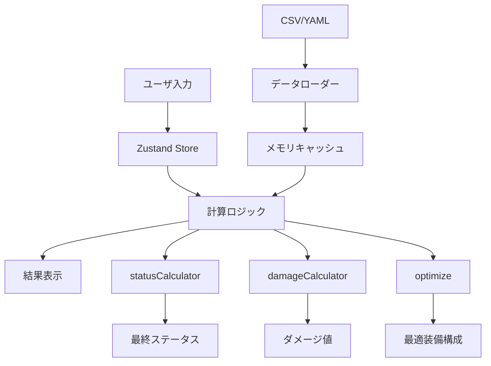
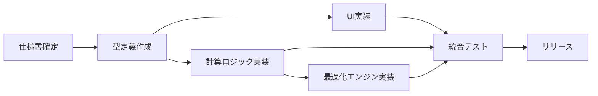

# 全体実装計画 (Implementation Plan)
**最終更新日**: 2025-11-24  
**バージョン**: v1.0  
**対象期間**: 2025年11月〜2026年2月 (約3ヶ月)

---

## 1. プロジェクト概要

### 1.1 目的

Minecraft RPG サーバーにおける **装備構成・ダメージ計算・最適化** を支援する Web アプリケーションを構築する。

### 1.2 ユースケース

1. **火力検証モード**: ユーザが任意の装備・スキルを設定し、ダメージを計算
2. **最適装備探索モード**: 条件を指定して最大火力を出す装備構成を自動探索
3. **ステータスシミュレーション**: 職業・レベル・SP 割り振りによるステータス変化を可視化

### 1.3 想定ユーザ

- Minecraft RPG プレイヤー (エンドコンテンツ攻略者)
- ダメージ検証を行う実況者・攻略サイト運営者
- ゲームバランス調整を行う運営メンバー

---

## 2. 技術スタック (Technology Stack)

### 2.1 フロントエンド

| 技術 | バージョン | 用途 |
|------|-----------|------|
| **Next.js** | 15.x | フレームワーク (App Router) |
| **React** | 19.x | UIライブラリ |
| **TypeScript** | 5.x | 型安全性の確保 |
| **Tailwind CSS** | 3.x | スタイリング |
| **Zustand** | 5.x | 状態管理 (軽量・シンプル) |

### 2.2 ビルド・開発環境

| 技術 | 用途 |
|------|------|
| **pnpm** | パッケージマネージャー |
| **ESLint** | コード品質チェック |
| **Prettier** | コードフォーマット |
| **Vitest** | 単体テスト (オプション) |

### 2.3 ホスティング (推奨)

| サービス | 用途 |
|---------|------|
| **Vercel** | 本番デプロイ (Next.js 最適化) |
| **GitHub** | コード管理・バージョン管理 |
| **GitHub Actions** | CI/CD パイプライン |

---

## 3. アーキテクチャ設計

### 3.1 ディレクトリ構造

```
DA_calc/
├── src/
│   ├── app/                  # Next.js App Router ページ
│   │   ├── page.tsx          # トップページ
│   │   ├── build/            # ビルド編集画面
│   │   ├── damage/           # ダメージ計算画面
│   │   └── optimize/         # 最適装備探索画面
│   ├── components/           # React コンポーネント
│   │   ├── JobSelector.tsx
│   │   ├── EquipmentSlot.tsx
│   │   ├── StatViewer.tsx
│   │   └── ui/               # 汎用UIコンポーネント
│   ├── lib/                  # ビジネスロジック・ユーティリティ
│   │   ├── calc/             # 計算ロジック
│   │   │   ├── statusCalculator.ts
│   │   │   ├── damageCalculator.ts
│   │   │   ├── equipmentCalculator.ts
│   │   │   ├── jobCalculator.ts
│   │   │   └── optimize.ts
│   │   └── data/             # データローダー
│   │       ├── csvLoader.ts
│   │       └── yamlLoader.ts
│   ├── store/                # Zustand ストア
│   │   └── buildStore.ts
│   ├── types/                # TypeScript 型定義
│   │   ├── equipment.ts
│   │   ├── job.ts
│   │   └── damage.ts
│   └── utils/                # 汎用関数
│       └── mathUtils.ts
├── public/                   # 静的ファイル
│   └── data/                 # CSV・YAML データ
│       ├── csv/
│       └── yaml/
├── ref/                      # 仕様書・設計書
│   ├── product/
│   │   ├── design/           # 仕様書
│   │   └── plan/             # 実装計画
│   └── system/
└── tests/                    # テストコード
    └── calc/
```

### 3.2 データフロー図



### 3.3 レイヤー構造

| レイヤー | 責務 | 依存方向 |
|---------|------|---------|
| **Presentation** | UI コンポーネント・ページ | ← Store |
| **Application** | 状態管理 (Zustand) | ← Domain |
| **Domain** | ビジネスロジック・計算 | ← Infrastructure |
| **Infrastructure** | データ読み込み・外部API | - |

**原則**: 上位レイヤーは下位レイヤーに依存するが、逆は禁止。

---

## 4. 実装フェーズ (Implementation Phases)

### Phase 1: 基盤整備・データ計算完成 (3週間)

**目標**: 計算ロジックを完成させ、手動モードで基本的なダメージ計算が可能に。

#### Week 1: 装備計算の完全実装

| タスク | 担当 | 工数 | 優先度 |
|--------|------|------|--------|
| 防具EXステータス計算の実装 | バックエンドA | 8h | High |
| アクセサリEXステータス計算の実装 | バックエンドA | 6h | High |
| ルーンストーンシステムの実装 | バックエンドA | 10h | High |
| 食事システムの実装 | バックエンドA | 4h | High |
| 装備計算の単体テスト | バックエンドA | 8h | Medium |

**成果物**: `equipmentCalculator.ts` の完成度を 53% → 85% に向上。

#### Week 2: スキル・ダメージ計算の拡充

| タスク | 担当 | 工数 | 優先度 |
|--------|------|------|--------|
| 主要30スキルのダメージ式実装 | バックエンドB | 16h | High |
| 武器追撃システムの基本実装 | バックエンドB | 10h | High |
| Hit数・マルチヒット対応 | バックエンドB | 8h | High |
| 丸め処理の統一 | バックエンドB | 4h | Medium |
| スキル計算の単体テスト | バックエンドB | 6h | Medium |

**成果物**: `damageCalculator.ts` の完成度を 77% → 90% に向上。

#### Week 3: SP割り振り・職業計算の強化

| タスク | 担当 | 工数 | 優先度 |
|--------|------|------|--------|
| 職業CSVデータの整備 | データエンジニア | 12h | High |
| SP解放スキル一覧の取得ロジック実装 | バックエンドA | 8h | High |
| YAML式評価エンジンの改善 | バックエンドA | 10h | High |
| 職業固有%補正の実装 | バックエンドA | 6h | Medium |
| 職業計算の統合テスト | バックエンドA | 4h | Medium |

**成果物**: `jobCalculator.ts` の完成度を 70% → 90% に向上。

**Phase 1 終了時の完成度**: **70% → 85%**

---

### Phase 2: UI/UX 完成・デザイン適用 (2週間)

**目標**: タブ構造の実装、デザインシステムの本格適用、ユーザ体験の向上。

#### Week 4: タブ構造・画面分割の実装

| タスク | 担当 | 工数 | 優先度 |
|--------|------|------|--------|
| ビルド編集画面のタブ構造実装 | フロントエンドA | 12h | High |
| 職業タブの実装 | フロントエンドA | 6h | High |
| SP割り振りタブの実装 | フロントエンドA | 8h | High |
| 装備タブの実装 | フロントエンドA | 10h | High |
| 最終ステータスタブの実装 | フロントエンドA | 6h | Medium |

**成果物**: ビルド編集画面の完成度を 70% → 90% に向上。

#### Week 5: デザインシステム適用・コンポーネント改善

| タスク | 担当 | 工数 | 優先度 |
|--------|------|------|--------|
| Tailwind カスタムテーマ設定 | フロントエンドB | 6h | High |
| Card コンポーネントの統一 | フロントエンドB | 8h | High |
| Button コンポーネントの統一 | フロントエンドB | 6h | High |
| Input コンポーネントの統一 | フロントエンドB | 6h | High |
| アニメーション実装 | フロントエンドB | 8h | Medium |
| レスポンシブ対応 | フロントエンドB | 10h | Medium |

**成果物**: デザインシステムの適用率を 40% → 85% に向上。

**Phase 2 終了時の完成度**: **85% → 92%**

---

### Phase 3: 最適化エンジン・高度機能 (2週間)

**目標**: 最適装備探索の実装、DPS計算、特殊武器能力の対応。

#### Week 6: 最適装備探索アルゴリズムの実装

| タスク | 担当 | 工数 | 優先度 |
|--------|------|------|--------|
| 装備組み合わせ列挙アルゴリズム | アルゴリズムエンジニア | 12h | High |
| 枝刈り最適化 (Dynamic Programming) | アルゴリズムエンジニア | 10h | High |
| プログレスバーUI実装 | フロントエンドA | 6h | Medium |
| 結果一覧表示UI | フロントエンドA | 8h | Medium |
| キャンセル機能の実装 | アルゴリズムエンジニア | 4h | Low |

**成果物**: `optimize.ts` の完成度を 23% → 80% に向上。

#### Week 7: DPS計算・特殊武器能力の実装

| タスク | 担当 | 工数 | 優先度 |
|--------|------|------|--------|
| DPS計算枠の実装 | バックエンドB | 10h | Medium |
| ケルベロス武器等の特殊能力実装 | バックエンドB | 12h | Medium |
| 追撃システムの完全実装 | バックエンドB | 10h | Medium |
| 耐性システムの実装 | バックエンドB | 8h | Low |
| 統合テスト | 全員 | 8h | High |

**成果物**: 特殊機能の実装完了、DPS計算の枠組み完成。

**Phase 3 終了時の完成度**: **92% → 98%**

---

### Phase 4: 仕上げ・リリース準備 (1週間)

**目標**: バグ修正、パフォーマンス最適化、ドキュメント整備。

#### Week 8: 最終調整・リリース準備

| タスク | 担当 | 工数 | 優先度 |
|--------|------|------|--------|
| バグ修正・QA | 全員 | 12h | High |
| パフォーマンス最適化 | バックエンド | 8h | High |
| エラーハンドリング強化 | フロントエンド | 6h | High |
| Local Storage 永続化実装 | フロントエンドA | 6h | Medium |
| ユーザマニュアル作成 | データエンジニア | 6h | Medium |
| デプロイ設定 (Vercel) | バックエンドA | 4h | High |
| リリースノート作成 | 全員 | 2h | Medium |

**Phase 4 終了時の完成度**: **98% → 100%**

---

## 5. マイルストーン (Milestones)

| マイルストーン | 完了日 | 完成度 | 主な成果物 |
|---------------|--------|--------|-----------|
| **M1: Phase 1 完了** | Week 3 終了 | 85% | 計算ロジック完成、基本動作可能 |
| **M2: Phase 2 完了** | Week 5 終了 | 92% | UI/UX 完成、デザイン適用完了 |
| **M3: Phase 3 完了** | Week 7 終了 | 98% | 最適化エンジン・高度機能完成 |
| **M4: Phase 4 完了 (リリース)** | Week 8 終了 | 100% | 本番リリース、ドキュメント整備 |

---

## 6. 品質保証計画 (QA Plan)

### 6.1 テスト戦略

| テストレベル | 範囲 | 実施タイミング |
|-------------|------|---------------|
| **単体テスト** | 計算ロジック・データローダー | 各機能実装後 |
| **統合テスト** | ページ間遷移・ストア連携 | Phase 2 終了時 |
| **E2Eテスト** | ユーザシナリオ全体 | Phase 3 終了時 |
| **性能テスト** | 最適化計算速度 | Phase 3 終了時 |
| **受け入れテスト** | 実際のプレイヤー検証 | Phase 4 開始時 |

### 6.2 テストケース例

#### 単体テスト (例: equipmentCalculator.ts)

```typescript
describe('calculateArmorStats', () => {
  it('should calculate armor stats with rank and hammering', () => {
    const armor = { basePower: 10, rank: 'SSS', hammering: 12, level: 100 };
    const result = calculateArmorStats(armor);
    expect(result.power).toBe(expectedValue);
  });
});
```

#### 統合テスト (例: ビルド編集 → ダメージ計算)

```typescript
describe('Build to Damage Flow', () => {
  it('should calculate damage after selecting equipment', () => {
    // 1. 装備選択
    buildStore.setState({ weapon: sampleWeapon });
    // 2. ステータス計算
    const stats = calculateFinalStats();
    // 3. ダメージ計算
    const damage = calculateBaseDamage.Sword(stats);
    expect(damage).toBeGreaterThan(0);
  });
});
```

### 6.3 テストカバレッジ目標

| カテゴリ | 目標カバレッジ |
|---------|---------------|
| 計算ロジック (`lib/calc/`) | 80% 以上 |
| データローダー (`lib/data/`) | 70% 以上 |
| コンポーネント (`components/`) | 60% 以上 |
| 全体 | 70% 以上 |

---

## 7. リスク管理 (Risk Management)

### 7.1 技術的リスク

| リスク | 発生確率 | 影響度 | 対策 |
|--------|---------|--------|------|
| YAML式評価の複雑化 | 高 | 高 | 式評価ライブラリの導入検討 (mathjs等) |
| 最適化計算の性能問題 | 中 | 高 | Web Worker による並列計算 |
| データ整合性の崩壊 | 中 | 高 | CSV/YAMLバリデーション自動化 |
| ブラウザ互換性問題 | 低 | 中 | Polyfill 導入、Safari/Firefox テスト |

### 7.2 プロジェクト管理リスク

| リスク | 発生確率 | 影響度 | 対策 |
|--------|---------|--------|------|
| 仕様変更の頻発 | 高 | 中 | 仕様凍結期間を設定 (Phase 2 開始前) |
| メンバーの途中離脱 | 中 | 高 | ドキュメント整備、ペアプログラミング |
| 工数見積もりの甘さ | 中 | 中 | 20% バッファを確保 |

---

## 8. 成功基準 (Success Criteria)

### 8.1 機能要件

- ✅ 全7武器種の通常攻撃ダメージ計算が正確に動作
- ✅ 主要30スキルのダメージ計算が実装済み
- ✅ 防具・アクセサリのEX計算が仕様通り動作
- ✅ ルーンストーン・食事システムが実装済み
- ✅ 最適装備探索が10秒以内に結果を返す (一般的な構成)

### 8.2 非機能要件

- ✅ ページ読み込み時間 3秒以内
- ✅ 計算結果の誤差 ±1% 以内
- ✅ モバイル対応 (レスポンシブデザイン)
- ✅ ブラウザサポート: Chrome, Firefox, Safari, Edge (最新版)

### 8.3 ユーザ満足度

- ✅ 実際のプレイヤー 10名以上による受け入れテスト
- ✅ バグ報告 < 5件 (Phase 4 終了時)
- ✅ ユーザからの肯定的フィードバック 80% 以上

---

## 9. 並列開発のための依存関係管理

### 9.1 依存関係図



### 9.2 並列開発のルール

1. **型定義の先行作成**: 全インターフェースを Week 1 で確定
2. **モックデータの活用**: 計算ロジック未完成でもUI開発を進める
3. **定期的な統合**: 毎週金曜日に統合ブランチをマージ
4. **コミュニケーション**: 毎日 15分の Standup Meeting

### 9.3 ブランチ戦略

```
main (本番)
  ├── develop (開発統合)
  │   ├── feature/equipment-ex-calc
  │   ├── feature/skill-damage-calc
  │   ├── feature/tab-structure
  │   └── feature/optimize-engine
  └── hotfix/* (緊急修正)
```

---

## 10. リリース計画

### 10.1 リリースフロー

1. **Week 8**: Phase 4 完了、QA 完了
2. **Week 8 終了**: `develop` → `main` マージ
3. **デプロイ**: Vercel にプッシュ (自動デプロイ)
4. **リリースノート公開**: GitHub Releases
5. **ユーザ告知**: Discord / Twitter 等

### 10.2 リリース後のサポート

- **バグ修正**: 優先度 High のバグは 24時間以内に対応
- **機能追加**: ユーザフィードバックを元に v1.1, v1.2 を計画
- **パフォーマンス改善**: 利用状況をモニタリング

---

## 11. 次のアクション

1. **仕様凍結の確認**: 全仕様書を再レビュー
2. **型定義の作成**: `types/` 配下のインターフェースを確定
3. **Phase 1 タスクの着手**: 担当者にタスクを割り当て
4. **開発環境のセットアップ**: 全メンバーがローカル環境を構築

---

## 変更履歴

| 日付 | バージョン | 変更内容 |
|------|-----------|---------|
| 2025-11-24 | v1.0 | 初版作成 |

---

**次のアクション**: `design-implementation.md` を参照して、デザインシステムの実装を開始してください。
